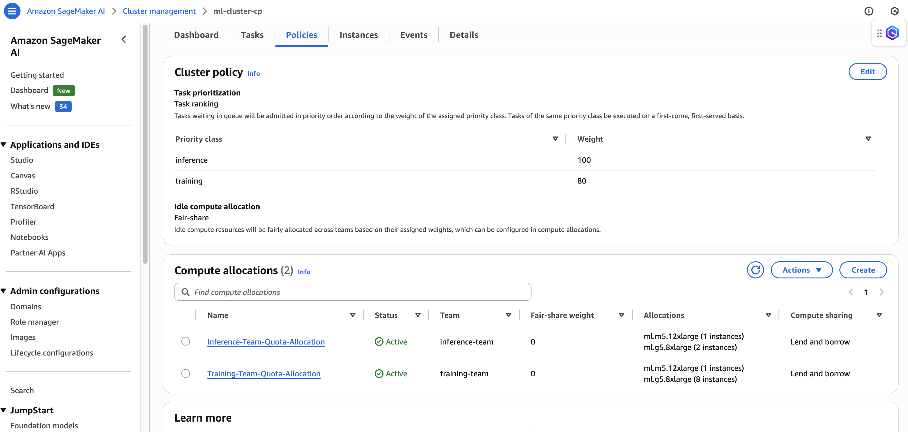
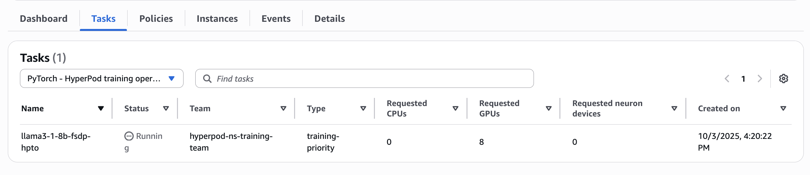
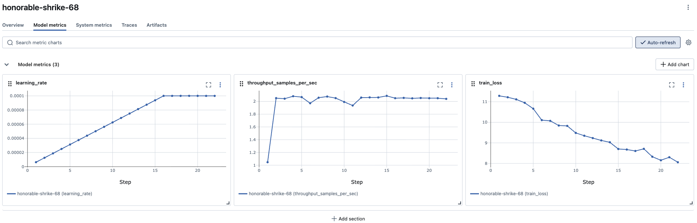
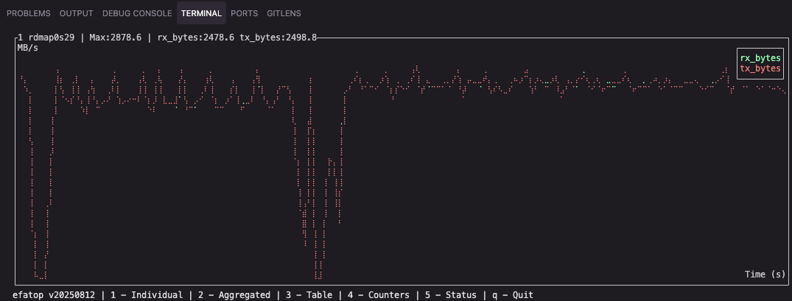
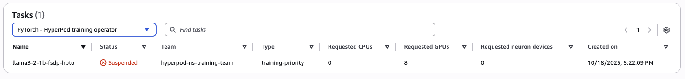
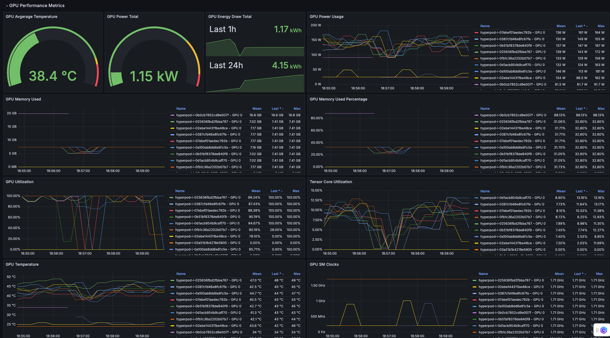
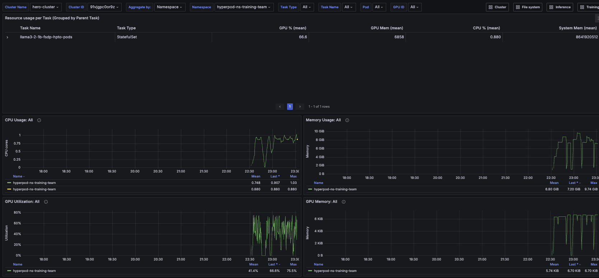
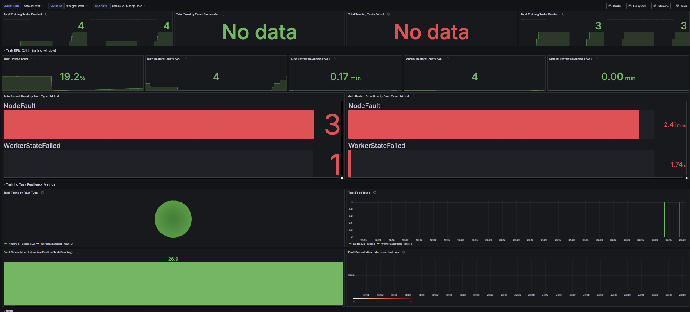

# HyperPod Hero Demo 🚀

This demo showcases how to efficiently orchestrate multi-user AI/ML training and inference jobs on a SageMaker HyperPod cluster orchestrated by EKS. 

## Key Features

- **GPU resource allocation** via [Task Governance](https://docs.aws.amazon.com/sagemaker/latest/dg/sagemaker-hyperpod-eks-operate-console-ui-governance.html)
- **Dynamic scaling** with Karpenter and [KEDA](https://keda.sh/) 
- **One-click observability** for cluster metrics using Amazon Managed Prometheus & Grafana
- **Seamless integration** with SageMaker Studio and FSx
- **Model observability** using [Amazon Managed MLFlow](https://docs.aws.amazon.com/sagemaker/latest/dg/mlflow.html)
- **Resiliency** with [HyperPod resiliency](https://docs.aws.amazon.com/sagemaker/latest/dg/sagemaker-hyperpod-resiliency-slurm.html) and the [HyperPod Training Operator](https://aws.amazon.com/blogs/machine-learning/accelerate-large-scale-ai-training-with-amazon-sagemaker-hyperpod-training-operator/)
- **Streamlined inference** with the [HyperPod Inference Operator](https://aws.amazon.com/blogs/machine-learning/amazon-sagemaker-hyperpod-launches-model-deployments-to-accelerate-the-generative-ai-model-development-lifecycle/)

This comprehensive showcase emphasizes HyperPod EKS's differentiators in handling diverse ML workloads at scale.


---

## Getting Started

### Prerequisites

Before running this demo, ensure you have:

**HyperPod EKS Cluster** with:
- [Continuous Provisioning enabled](https://docs.aws.amazon.com/sagemaker/latest/dg/sagemaker-hyperpod-scaling-eks.html)
- [Autoscaling enabled](https://docs.aws.amazon.com/sagemaker/latest/dg/sagemaker-hyperpod-eks-autoscaling.html)
- [HyperPod Training Operator](https://docs.aws.amazon.com/sagemaker/latest/dg/sagemaker-eks-operator.html) toggled on at cluster creation
- [HyperPod Inference Operator](https://docs.aws.amazon.com/sagemaker/latest/dg/sagemaker-hyperpod-model-deployment-setup.html) toggled on at cluster creation
- **10 g5.8xlarge instances** (persistent instance group)
- **2 m5.12xlarge instances** (head instance group)  
- **0 instances of g5.8xlarge** (autoscaling instance group)

**Additional Setup:**
- [SageMaker Studio](https://github.com/aws-samples/awsome-distributed-training/blob/main/1.architectures/7.sagemaker-hyperpod-eks/cfn-templates/sagemaker-studio-stack.yaml) configured

---

## 1. Set up the HyperPod Container Environment

### 1.1 Clone and Setup

```bash
# Clone this repository
git clone https://github.com/mvinci12/hero-demo-hyperpod.git
cd hero-demo-hyperpod
```

### 1.2 Launch Container Environment

Run the [aws-do-hyperpod](https://github.com/aws-samples/aws-do-hyperpod/tree/main) container with this repo mounted:

```bash
docker run --name=do-hyperpod-use1 \
  --hostname=deb706ea3971 \
  --mac-address=8a:15:14:f3:90:39 \
  --volume /var/run/docker.sock:/var/run/docker.sock \
  --volume $(pwd):/hero-demo-hyperpod \
  --volume ~/.kube:/root/.kube \
  --volume ~/.aws:/root/.aws \
  --network=bridge \
  --workdir=/hyperpod \
  --detach=true \
  public.ecr.aws/hpc-cloud/aws-do-hyperpod:latest \
  tail -f /dev/null
```

```bash
# Exec into the container
docker exec -it do-hyperpod-use1 bash
```

> **Why use the container?** The aws-do-hyperpod container provides a pre-configured environment with all necessary tools (kubectl, aws CLI, Kubernetes utilities like kubectx/kubens, and HyperPod management scripts) already installed. This containerized approach follows the do-framework principles to simplify DevOps tasks. If you prefer your local environment, ensure you have kubectl, aws CLI, and proper cluster access configured.

### 1.3 Navigate to Project Directory

```bash
cd /hero-demo-hyperpod
```

<br>

### 1.4 Configure Environment Variables

The HyperPod environment variables will be used throughout this repo.

Configure and source `env_vars`:
``` bash
source env_vars
```

<br>

### 1.5 Verify kubectl Access

Update your kubeconfig with cluster credentials:

```bash
aws eks update-kubeconfig --name $EKS_CLUSTER_NAME
```

**Verify connection:**
```bash
kubectl config current-context 
```
Expected output:
```
arn:aws:eks:us-west-2:xxxxxxxxxxxx:cluster/hyperpod-eks-cluster
```

```bash
kubectl get svc
```
Expected output:
```
NAME             TYPE        CLUSTER-IP   EXTERNAL-IP PORT(S)   AGE
svc/kubernetes   ClusterIP   10.100.0.1   <none>      443/TCP   1m
```

<br>

### 1.6 Verify Cluster Nodes

View your cluster nodes:

```bash
# Using container shortcut (if in aws-do-hyperpod container)
kgn

# Or standard kubectl command
kubectl get nodes
```

**Expected output:**
```
NAME                           STATUS   ROLES    AGE     VERSION               INSTANCE-TYPE    NODE-HEALTH-STATUS   DEEP-HEALTH-CHECK-STATUS
NAME                           STATUS   ROLES    AGE     VERSION               INSTANCE-TYPE   NODE-HEALTH-STATUS   DEEP-HEALTH-CHECK-STATUS
hyperpod-i-025636fbd2fbba767   Ready    <none>   5h1m    v1.32.9-eks-113cf36   ml.g5.8xlarge   Schedulable          
hyperpod-i-02ebe144311be48ce   Ready    <none>   5h1m    v1.32.9-eks-113cf36   ml.g5.8xlarge   Schedulable          
hyperpod-i-0387cfd46e8fc67fe   Ready    <none>   5h1m    v1.32.9-eks-113cf36   ml.g5.8xlarge   Schedulable          
hyperpod-i-0400a27e2a27d2c42   Ready    <none>   39m     v1.32.9-eks-113cf36   ml.g5.8xlarge   Schedulable          
hyperpod-i-07ebef01aedec792b   Ready    <none>   5h1m    v1.32.9-eks-113cf36   ml.g5.8xlarge   Schedulable          
hyperpod-i-0a100ab8dd6e81c5e   Ready    <none>   5h1m    v1.32.9-eks-113cf36   ml.g5.8xlarge   Schedulable          
hyperpod-i-0b51bf8378de840f9   Ready    <none>   5h1m    v1.32.9-eks-113cf36   ml.g5.8xlarge   Schedulable          
hyperpod-i-0cfc430f774dd4b1a   Ready    <none>   4h39m   v1.32.9-eks-113cf36   ml.g5.8xlarge   Schedulable          
hyperpod-i-0d1acb954b9caff70   Ready    <none>   5h1m    v1.32.9-eks-113cf36   ml.g5.8xlarge   Schedulable          
hyperpod-i-0fb1c36a2202b07b7   Ready    <none>   5h1m    v1.32.9-eks-113cf36   ml.g5.8xlarge   Schedulable
hyperpod-i-0fc9b9f110fa4a55c   Ready    <none>   24d     v1.32.3-eks-473151a   ml.m5.12xlarge   Schedulable
hyperpod-i-0fc9b9f110fa4a55c   Ready    <none>   24d     v1.32.3-eks-473151a   ml.m5.12xlarge   Schedulable              
```

---

## 2. Configure Karpenter Autoscaling

### 2.1 Create NodeClass and NodePool Resources

The autoscaling setup uses Karpenter with HyperPod-specific NodeClass and NodePool resources. These files define how Karpenter should manage your autoscaling instance groups.

**Apply the NodeClass:**
```bash
kubectl apply -f autoscaling/nodeclass.yaml
```

**Apply the NodePool:**
```bash
kubectl apply -f autoscaling/nodepool.yaml
```

<br>

### 2.2 Verify Autoscaling Configuration

**Check NodeClass status:**
```bash
kubectl get hyperpodnodeclass sample-nc -o yaml
```

**Check NodePool status:**
```bash
kubectl get nodepool sample-np -o yaml
```

Both resources should show `Ready: True` in their status conditions.

> **💡 Important:** Your autoscaling instance group (`worker-group-1`) should start with 0 nodes. Karpenter will automatically scale up nodes when pods are scheduled and scale them down when they're no longer needed.

---

## 3. Set up Task Governance

### 3.1 Installation

To install the SageMaker HyperPod task governance EKS add-on, run the following command:
``` bash
aws eks create-addon --region $AWS_REGION --cluster-name $EKS_CLUSTER_NAME --addon-name amazon-sagemaker-hyperpod-taskgovernance
```

<br>

Verify successful installation with:
``` bash
aws eks describe-addon --region $AWS_REGION --cluster-name $EKS_CLUSTER_NAME --addon-name amazon-sagemaker-hyperpod-taskgovernance
```
If the installation was successful, you should see details about the installed add-on in the output.

<br>

### 3.2 Setup Cluster Policy

Cluster policy will set up how tasks are prioritized and how idle compute is allocated. Apply a Cluster Policy using the following configuration:

``` bash
aws sagemaker \
    create-cluster-scheduler-config \
    --name "example-cluster-scheduler-config" \
    --cluster-arn $HYPERPOD_CLUSTER_ARN \
    --scheduler-config "PriorityClasses=[{Name=inference,Weight=100},{Name=training,Weight=80}],FairShare=Enabled"
```

> **📋 What this cluster policy does:**
> - **Priority Classes**: Creates two priority levels - `inference` jobs get higher priority (weight 100) than `training` jobs (weight 80)
> - **Fair Share**: Enables fair resource distribution among users and teams when multiple jobs compete for resources
> - **Resource Allocation**: Ensures inference workloads get preferential access to compute while still allowing training jobs to utilize available capacity
> - **Multi-tenancy**: Supports multiple teams submitting jobs simultaneously with predictable resource allocation behavior

To verify creation, run:
``` bash
aws sagemaker list-cluster-scheduler-configs
```

### 3.3 Create Compute Quotas for Teams

Compute quotas allow you to allocate specific amounts of compute resources to different teams, ensuring fair resource distribution and preventing any single team from consuming all available capacity. Each team gets their own quota with borrowing capabilities for efficient resource utilization.

<br>

### 3.4 Create Training Team Quota

Create a compute quota for the training team with 6 ml.g5.8xlarge instances:

```bash
aws sagemaker \
    create-compute-quota \
    --name "Training-Team-Quota" \
    --cluster-arn $HYPERPOD_CLUSTER_ARN \
    --compute-quota-config "ComputeQuotaResources=[{InstanceType=ml.g5.8xlarge,Count=6}],ResourceSharingConfig={Strategy=LendAndBorrow,BorrowLimit=50},PreemptTeamTasks=LowerPriority" \
    --activation-state "Enabled" \
    --compute-quota-target "TeamName=training-team,FairShareWeight=0"
```

<br>

### 3.5 Create Inference Team Quota

Create a compute quota for the inference team with 4 ml.g5.8xlarge instances:

```bash
aws sagemaker \
    create-compute-quota \
    --name "Inference-Team-Quota" \
    --cluster-arn $HYPERPOD_CLUSTER_ARN \
    --compute-quota-config "ComputeQuotaResources=[{InstanceType=ml.g5.8xlarge,Count=4}],ResourceSharingConfig={Strategy=LendAndBorrow,BorrowLimit=50},PreemptTeamTasks=LowerPriority" \
    --activation-state "Enabled" \
    --compute-quota-target "TeamName=inference-team,FairShareWeight=0"
```

<br>

### 3.6 Verify Compute Quotas

**List all compute quotas:**
```bash
aws sagemaker list-compute-quotas --cluster-arn $HYPERPOD_CLUSTER_ARN
```

> **💡 Quota Configuration Explained:**
> - **Training Team**: Gets 6 ml.g5.8xlarge instances as their base allocation
> - **Inference Team**: Gets 4 ml.g5.8xlarge instances as their base allocation
> - **Resource Sharing**: Both teams can lend unused resources and borrow up to 50% additional capacity when available
> - **Preemption**: Lower priority tasks can be preempted when higher priority teams need resources
> - **Fair Share Weight**: Set to 0 for both teams, meaning they rely on their quota allocations rather than fair share scheduling

View in HyperPod console:

<div align="center">



</div>

Your cluster is now configured with team-based compute quotas that ensure fair resource allocation while allowing efficient resource sharing between teams!

## 4. Set up SageMaker Managed MLFlow

To see more instructions on setting up MLFlow, see the [documentation](https://docs.aws.amazon.com/sagemaker/latest/dg/mlflow.html) and [AI on SageMaker instructions](https://awslabs.github.io/ai-on-sagemaker-hyperpod/docs/add-ons/Observability/MLFlow).

We have already decorated our Dockerfile, training YAML, and Python code for MLFlow integration. The last part of this is to run:

1. Set up Service Account:
``` bash
./mlflow/setup-mlflow.sh
```

2. Create Tracking Server:
``` bash
./mlflow/create-trackingserver.sh
```

3. Create MLFlow UI:
``` bash
./mlflow/create-ui.sh
```

## 5. Set up Training Resources

### 5.1 Install HyperPod Training Operator

If you haven't installed the HyperPod Training Operator via the cluster creation toggle, install it at this point:

- Install [cert-manager](https://cert-manager.io/docs/installation/)
- Set up the [EKS Pod Identity Agent using the console](https://docs.aws.amazon.com/eks/latest/userguide/pod-id-agent-setup.html). If you want to use the AWS CLI, use the following command:

```bash
aws eks create-addon --cluster-name $EKS_CLUSTER_NAME --addon-name eks-pod-identity-agent --region $AWS_REGION
```

**Now, install HPTO via the SageMaker AI console:**

1. Open the Amazon SageMaker AI console at https://console.aws.amazon.com/sagemaker/
2. Go to your cluster's details page
3. On the Dashboard tab, locate the add-on named Amazon SageMaker HyperPod training operator, and choose install
4. During the installation process, SageMaker AI creates an IAM execution role with permissions similar to the [AmazonSageMakerHyperPodTrainingOperatorAccess](https://docs.aws.amazon.com/aws-managed-policy/latest/reference/AmazonSageMakerHyperPodTrainingOperatorAccess.html) managed policy and creates a pod identity association between your Amazon EKS cluster and your new execution role

### 5.2 Build Docker Image

Before submitting our job, we need to build and push our Docker image to our ECR. This image will contain all of our job dependencies, libraries, and code to submit the training job. 

To build and push your image to ECR, please run:
``` bash
./training/build-push.sh
```

### 5.3 Create PVC in `hyperpod-ns-training-team` Namespace

Since PVCs are namespace isolated and the cluster creation creates our FSx PVC in the `default` namespace, we can create a PVC using static provisioning in the `hyperpod-ns-training-team` namespace, where we will submit our training job.

To do this, run this script:
``` bash
./training/create-pvc.sh
```


## 6. Set up Inference Operator

### 6.1 Install Inference Operator

If you haven't installed the HyperPod Inference Operator via the cluster creation toggle, install it at this point. Follow the [installation instructions](https://docs.aws.amazon.com/sagemaker/latest/dg/sagemaker-hyperpod-model-deployment-setup.html).

---

## Running the Demo

## 7. Submit FSDP Training Job

### 7.1 Submit Training Job

Now we are ready to submit our FSDP job with the HyperPod Training Operator.

As the training team, we will be submitting a HyperPodPyTorchJob that requires **8 instances** but only has **6 allocated**. Task Governance allows the Training Team to **borrow** 2 instances from the Inference Team's capacity.

To submit, run:
``` bash
./training/submit-job.sh
```

Output:
```
root@deb706ea3971:/hero-demo-hyperpod# ./training/submit-job.sh 
Running: envsubst < hpto_5b.yaml | kubectl apply -f -
Creating HyperPod PytorchJob for training Llama3 5B parameter model...

hyperpodpytorchjob.sagemaker.amazonaws.com/llama3-1-8b-fsdp-hpto created
```

View your job pods:
``` bash
kgp -n hyperpod-ns-training-team
```

While the Kubernetes pods are pulling the image from ECR, here's a little bit about our job:

> **📋 Job YAML Configuration & Task Governance Integration**
> 
> Our training job (`hpto_5b.yaml`) demonstrates several key integrations with HyperPod's task governance system:
> 
> **Team Identification:**
> - **Namespace**: `hyperpod-ns-training-team` - This namespace identifies the job as belonging to the training team
> - **Queue Label**: `kueue.x-k8s.io/queue-name: hyperpod-ns-training-team-localqueue` - Routes the job through the training team's resource queue
> - **Priority Class**: `kueue.x-k8s.io/priority-class: training-priority` - Assigns training priority level (weight 80) as defined in our cluster policy
> 
> **Resource Management:**
> - The job requests GPU and EFA resources per node using environment variables (`$GPU_PER_NODE`, `$EFA_PER_NODE`)
> - Task governance automatically applies the training team's compute quota (6 ml.g5.8xlarge instances, borrowing 2 ml.g5.8xlarge instances)
> - Resource sharing allows borrowing up to 50% additional capacity when available from other teams
> 
> **HyperPod Training Operator Features:**
> - **Fault Tolerance**: `jobMaxRetryCount: 10` with intelligent restart policies
> - **Health Monitoring**: Log pattern monitoring detects job start and hanging scenarios
> - **Topology Awareness**: Pod anti-affinity and node affinity ensure optimal GPU placement
> - **Managed Tiered Checkpointing**: Automatic checkpoint management with configurable frequency
> - **EFA Networking**: High-performance networking configuration for distributed training
> 
> The operator handles the complexity of distributed PyTorch training while task governance ensures fair resource allocation across teams.


When your pods go into `Running` state, you can view your pod logs via [kubetail](https://github.com/johanhaleby/kubetail):
``` bash
kubetail llama3 -n hyperpod-ns-training-team
```

We will start seeing outputs similar to this when it's training:
```
[llama3-1-8b-fsdp-hpto-pods-6] INFO:     10.1.144.242:35242 - "GET /status HTTP/1.1" 200 OK
[llama3-1-8b-fsdp-hpto-pods-0] [default0]:2025-10-03 20:25:09,196 [INFO] __main__: Batch 1 Loss: 11.61360, Speed: 0.56 samples/sec, lr: 0.000063
[llama3-1-8b-fsdp-hpto-pods-2] INFO:     10.1.144.242:37102 - "GET /status HTTP/1.1" 200 OK
```

We can also see our job submitting by team `hyperpod-ns-training-team` with the `training-priority` on the HyperPod console, with a request of 8 GPUs:

<div align="center">



</div>

Another way you can check the status of your job is to see it through SageMaker Managed MLFlow. As configured in [Section 4](#4-set-up-sagemaker-managed-mlflow), you can access the MLFlow UI to monitor training metrics and job progress.

Example of what it may look like on the MLFlow UI:

<div align="center">



</div>

### 7.2 Resiliency Demonstration

At this point while the training is happening, let's emulate a GPU error where the node will have to get rebooted. To do this, we can run:
``` bash
./training/node-error.sh
```

When we run this, then check the health of our nodes, we will see one of our GPU nodes in an unhealthy state. Check node status with this command:
``` bash
kgn
```

Output (look under `STATUS` and `NODE-HEALTH-STATUS`):
```
root@deb706ea3971:/hero-demo-hyperpod# kgn

kubectl get nodes -L node.kubernetes.io/instance-type -L sagemaker.amazonaws.com/node-health-status -L sagemaker.amazonaws.com/deep-health-check-status 

NAME                           STATUS   ROLES    AGE     VERSION               INSTANCE-TYPE    NODE-HEALTH-STATUS           DEEP-HEALTH-CHECK-STATUS
hyperpod-i-00032a01f65f15741   Ready    <none>   21d     v1.32.3-eks-473151a   ml.m5.12xlarge   Schedulable                  
hyperpod-i-076a8fd1fb47273d2   NotReady    <none>   25h     v1.32.3-eks-473151a   ml.g5.8xlarge    **UnschedulablePendingReboot**   
hyperpod-i-08335947b01f32169   Ready    <none>   25h     v1.32.3-eks-473151a   ml.g5.8xlarge    Schedulable                  
hyperpod-i-0881939d060d22431   Ready    <none>   8d      v1.32.3-eks-473151a   ml.g5.8xlarge    Schedulable                  
hyperpod-i-0ab2d0831345d7b78   Ready    <none>   8d      v1.32.3-eks-473151a   ml.g5.8xlarge    Schedulable                  
hyperpod-i-0ab6b32bad77da72a   Ready    <none>   7d23h   v1.32.3-eks-473151a   ml.g5.8xlarge    Schedulable                  
hyperpod-i-0c5cdf28e608bddd7   Ready    <none>   8d      v1.32.3-eks-473151a   ml.g5.8xlarge    Schedulable                  
hyperpod-i-0dfe5b8b3c59343e4   Ready    <none>   8d      v1.32.3-eks-473151a   ml.g5.8xlarge    Schedulable                  
hyperpod-i-0fc9b9f110fa4a55c   Ready    <none>   24d     v1.32.3-eks-473151a   ml.m5.12xlarge   Schedulable                                  
```

If you look at your pods, you will also see the status being `Pending` by running this command:
``` bash
kgp -o wide -n hyperpod-ns-training-team
```

Output:
```
root@deb706ea3971:/hero-demo-hyperpod# kgp -n hyperpod-ns-training-team
NAME                           READY   STATUS    RESTARTS   AGE
llama3-1-8b-fsdp-hpto-pods-0   1/1     Running   0          10m
llama3-1-8b-fsdp-hpto-pods-1   1/1     Running   0          10m
llama3-1-8b-fsdp-hpto-pods-2   1/1     Running   0          10m
llama3-1-8b-fsdp-hpto-pods-3   1/1     Running   0          10m
llama3-1-8b-fsdp-hpto-pods-4   1/1     Running   0          10m
llama3-1-8b-fsdp-hpto-pods-5   1/1     Running   0          10m
llama3-1-8b-fsdp-hpto-pods-6   1/1     Running   0          10m
llama3-1-8b-fsdp-hpto-pods-7   0/1     Pending   0          11s
```


Once the node is rebooted, the node and pod status will become healthy again, and the training will resume from the last saved checkpoint.

When you describe the `HyperPodPytorchJob` you will see more details about the resiliency events:
``` bash
k describe hyperpodpytorchjob -n hyperpod-ns-training-team
```

Output:
```
Events:
  Type     Reason                 Age    From                             Message
  ----     ------                 ----   ----                             -------
  Normal   JobInitiallySuspended  19m    hyperpod-pytorch-job-controller  The job was suspended during it's creation. The job will resume when admitted by kueue. See the queue hyperpod-ns-training-team-localqueue for details
  Normal   CreatedWorkload        19m    kueue                            Created Workload: hyperpod-ns-training-team/hyperpodpytorchjob-llama3-1-8b-fsdp-hpto-077cd
  Normal   Started                19m    kueue                            Admitted by clusterQueue hyperpod-ns-training-team-clusterqueue
  Normal   Created                19m    hyperpod-pytorch-job-controller  Created by HyperPod Training Operator controller
  Normal   Running                16m    hyperpod-pytorch-job-controller  
  Warning  NodeFault              8m27s  hyperpod-pytorch-job-controller  Found unhealthy node hyperpod-i-076a8fd1fb47273d2
  Normal   Running                6m45s  hyperpod-pytorch-job-controller  The fault of reason NodeFault was remediated in 102590 milliseconds.
```

View the job continue from its last saved checkpoint by running:
``` bash
kubetail llama3 -n hyperpod-ns-training-team
```


Another cool feature we can demonstrate with the `aws-do-hyperpod` container is we can see EFA utilization from the training job with 1 command:

```
export NODE=$(kubectl get nodes -L node.kubernetes.io/instance-type | awk '$NF ~ /ml\.g5\./ && NR>1 {print $1}' | shuf -n 1)
eu $NODE
```

<div align="center">



</div>

Now that we submitted our training job, let's change hats to be the Inference Team...


---

## 8. Deploy Llama Model for Inference

### 8.1 Deploy Model

Once the model is uploaded, please have a look at our `deploy_s3_inference.yaml`:
``` bash
cat inference/jumpstart.yaml
```

> **📋 Inference Deployment Configuration:**
> 
> This YAML defines a HyperPod model deployment that:
> - Deploys the `huggingface-llm-mistral-7b-instruct-v3` model from JumpStart storage to the inference team's namespace
> - Integrates with task governance through the inference team's resource queue and priority class
> - Configures autoscaling, health checks, and load balancing for production inference workloads

To deploy our model, run:
``` bash
./inference/submit-jumpstart.sh
```

### 8.2 Verify Deployment Status

Check if the model successfully deployed:
```bash
kubectl describe jumpstartmodel -n hyperpod-ns-inference-team
```

Wait for the model to be fully loaded and ready:
```bash
# kubectl logs -f deployment/deepseek15b-autoscale -n default
kubectl logs -f deployment/mistral-jumpstart-autoscale -n hyperpod-ns-inference-team
```

Look for the message:

```
2025-10-13T22:11:52.564139Z  INFO text_generation_launcher: Using default cuda graphs [1, 2, 4, 8, 16, 32]
2025-10-13T22:11:52.564228Z  INFO download: text_generation_launcher: Starting download process.
2025-10-13T22:11:55.578709Z  INFO text_generation_launcher: Files are already present on the host. Skipping download.

2025-10-13T22:11:56.268206Z  INFO download: text_generation_launcher: Successfully downloaded weights.
2025-10-13T22:11:56.268439Z  INFO shard-manager: text_generation_launcher: Starting shard rank=0
2025-10-13T22:12:05.952613Z  INFO text_generation_launcher: Server started at unix:///tmp/text-generation-server-0

2025-10-13T22:12:05.978713Z  INFO shard-manager: text_generation_launcher: Shard ready in 9.709293463s rank=0
2025-10-13T22:12:06.076751Z  INFO text_generation_launcher: Starting Webserver
2025-10-13T22:12:06.155020Z  INFO text_generation_router: router/src/main.rs:289: Using config Some(Mistral)
2025-10-13T22:12:06.155065Z  WARN text_generation_router: router/src/main.rs:298: no pipeline tag found for model /opt/ml/model
2025-10-13T22:12:06.158565Z  INFO text_generation_router: router/src/main.rs:317: Warming up model
2025-10-13T22:12:08.759489Z  INFO text_generation_launcher: Cuda Graphs are enabled for sizes [1, 2, 4, 8, 16, 32]

2025-10-13T22:12:09.754597Z  INFO text_generation_router: router/src/main.rs:354: Setting max batch total tokens to 43808
2025-10-13T22:12:09.754618Z  INFO text_generation_router: router/src/main.rs:355: Connected
2025-10-13T22:12:09.754621Z  WARN text_generation_router: router/src/main.rs:369: Invalid hostname, defaulting to 0.0.0.0
```

Check that the endpoint is successfully created. This will be created after your EC2 load balancer is successfully created. You can check this in the EC2 console.

```bash
kubectl describe SageMakerEndpointRegistration -n hyperpod-ns-inference-team
```
If it's created, you will see this output:
```
    Message:               Endpoint has been successfully created.
    Observed Generation:   1
    Reason:                Success
    Status:                True
    Type:                  CreationCompleted
```

Once this is created, our model is ready for deployment.

At this point, we can invoke our model with the `invoke_jumpstart.py` Python file that will ask our model the question: "Hi, is water wet?"

```bash
python3 inference/invoke_jumpstart.py
```

---

## 9. Inference Pod-Level Autoscaling Demo

Now for the pod-level autoscaling demonstration, our `monitor_autoscaling.sh` script provides an intuitive view to see the pods scale for the invocations.

Our `load_test_jumpstart.py` generates realistic inference load - 10 requests per second for 10 minutes with 15 concurrent workers. Each request asks the model to explain machine learning concepts, generating substantial CloudWatch metrics. This script will generate a total of 4 inference pods. 

BUT WAIT, here's the critical part - the inference team has 4 ml.g5.8xlarge instances allocated, but the training team is currently using 8 instances total, borrowing 2 from the inference team's quota.

When inference needs to scale up, task governance kicks in with preemption. Since inference was guaranteed this compute, the system will preempt the training pods to free up resources for the inference scaling. You'll see some training pods get evicted and go into Pending state as the inference pods claim those nodes.


This deployment includes:
- **Min replicas**: 1 (always have at least one pod running)
- **Max replicas**: 4 (can scale up to 4 pods during high traffic)
- **CloudWatch trigger**: Scales based on SageMaker endpoint invocations
- **Target value**: 5 invocations per pod (when exceeded, triggers scale-up)


### 9.1 Monitor Autoscaling Setup

In a separate terminal, start monitoring the autoscaling activity:
```bash
./inference/monitor_autoscaling.sh
```

This will show real-time updates of:
- Deployment replica count
- Pod status and distribution
- HPA (Horizontal Pod Autoscaler) metrics
- KEDA ScaledObject status
- Recent Kubernetes events


### 9.2 Load Testing and Autoscaling

Now let's generate load to trigger autoscaling. The load test will send concurrent requests to create CloudWatch metrics that trigger the autoscaler.

**Start the load test:**
```bash
python3 inference/load_test.py \
  --endpoint mistral-autoscale-endpoint \
  --requests 200 \
  --rps 10 \
  --duration 10 \
  --workers 15
```

At this point, we will see our training job is suspended in the HyperPod Task Governance console:

<div align="center">



</div>

If we were to describe the training workload using this command:
``` bash
kubectl describe workload -n hyperpod-ns-training-team
```

You will see these events:
```
 Normal   Preempted      4m47s                  kueue-admission  Preempted to accommodate a workload (UID: c3758835-94d0-42ee-a2c5-789eba7ce8a2, JobUID: d7e5a7c5-0d47-42ef-a0a2-862bd2d8ee00) due to Fair Sharing within the cohort
  Warning  Pending        4m46s                  kueue-admission  couldn't assign flavors to pod set llama3-2-1b-fsdp-hpto-pods-podset: topology "hyperpod-default" doesn't allow to fit any of 8 pod(s)
  Warning  Pending        4m36s                  kueue-admission  Workload no longer fits after processing another workload
  Warning  Pending        4m36s (x3 over 4m36s)  kueue-admission  couldn't assign flavors to pod set llama3-2-1b-fsdp-hpto-pods-podset: insufficient quota for nvidia.com/gpu in flavor ml.m5.12xlarge, request > maximum capacity (8 > 0), insufficient unused quota for nvidia.com/gpu in flavor ml.g5.8xlarge, 1 more needed
  Warning  Pending        16s (x11 over 4m16s)   kueue-admission  couldn't assign flavors to pod set llama3-2-1b-fsdp-hpto-pods-podset: insufficient quota for nvidia.com/gpu in flavor ml.m5.12xlarge, request > maximum capacity (8 > 0), insufficient unused quota for nvidia.com/gpu in flavor ml.g5.8xlarge, 2 more needed
```

**Load test parameters:**
- `--endpoint`: The SageMaker endpoint name (note the `-s3` suffix)
- `--requests`: Total number of requests to send
- `--rps`: Requests per second rate
- `--duration`: How long to run the test (minutes)
- `--workers`: Maximum concurrent threads

The observability terminal should eventually show something similar to:

```
🎯 Monitoring mistral-jumpstart-autoscale autoscaling (Press Ctrl+C to stop)
Time     | Pods | Status
---------|------|--------------------------------------------------
Time     | Pods | Status
---------|------|--------------------------------------------------
23:59:54 | 1    | 🔵 Stable: 1/1 ready
00:00:11 | 1    | 🔵 Stable: 1/1 ready
00:00:19 | 1    | 🔵 Stable: 1/1 ready
00:00:28 | 1    | 🔵 Stable: 1/1 ready
00:00:36 | 1    | 🔵 Stable: 1/1 ready
00:02:40 | 1    | 🔵 Stable: 1/1 ready
00:02:49 | 1    | 🔵 Stable: 1/1 ready
00:02:57 | 1    | 🔵 Stable: 1/1 ready
00:03:05 | 1    | 🔵 Stable: 1/1 ready
00:03:14 | 1    | 🔵 Stable: 1/1 ready
00:03:22 | 1    | 🟡 Scaling: 1/4 ready
00:03:31 | 1    | 🟡 Scaling: 1/4 ready
00:05:54 | 1    | 🟡 Scaling: 1/4 ready
00:06:02 | 1    | 🟡 Scaling: 1/4 ready
00:06:19 | 1    | 🟡 Scaling: 1/4 ready
00:06:27 | 4    | 🟢 Scaled up: 4/4 ready
00:06:35 | 4    | 🟢 Scaled up: 4/4 ready
00:06:43 | 4    | 🟢 Scaled up: 4/4 ready
00:06:52 | 4    | 🟢 Scaled up: 4/4 ready
```

After the load test completes and the 5-minute cooldown period passes, inference scales back down to 1 pod, freeing up those resources. Task governance then allows the preempted training pods to reschedule and resume from their last checkpoint.


#### Autoscaling Configuration Details

The autoscaling behavior is controlled by these key settings in `deploy_s3_inference.yaml`:

```yaml
autoScalingSpec:
  minReplicaCount: 1                    # Always keep 1 pod running
  maxReplicaCount: 4                    # Scale up to 4 pods maximum
  pollingInterval: 30                   # Check metrics every 30 seconds
  scaleUpStabilizationTime: 0           # Scale up immediately when needed
  scaleDownStabilizationTime: 300       # Wait 5 minutes before scaling down
  cloudWatchTrigger:
    targetValue: 5.0                    # Target 5 invocations per pod
    metricName: "Invocations"           # SageMaker endpoint invocations
    metricStat: "Sum"                   # Sum of invocations over period
    metricCollectionPeriod: 60          # 1-minute collection window
```

**Minutes 0-2**: Load test starts, single pod handles initial requests

**Minutes 2-4**: CloudWatch metrics accumulate, showing >5 invocations per pod

**Minutes 4-6**: HPA triggers scale-up, new pods are created

**Minutes 6-8**: Multiple pods serve traffic, load is distributed

**Minutes 8-12**: Load test completes, invocation rate drops

**Minutes 12-17**: Cooldown period prevents immediate scale-down

**Minutes 17+**: Pods scale back down to minimum (1 pod)

### 7.3 Karpenter Autoscaling
#### Setup

Now, let’s say another team came in and wants to deploy their inference job using a deepseek model that the training team customized and saved it in S3... but there’s no compute! 

With HyperPod, if set by your IT admin, we can use its infrastructure-level autoscaling capabilities to scale out and in based on demand. Let’s demonstrate this. 

To do this, let's first place our model in our S3 bucket ([we can also deploy from FSx or Jumpstart](https://docs.aws.amazon.com/sagemaker/latest/dg/sagemaker-hyperpod-model-deployment-deploy.html))

``` bash
aws s3 sync s3://jumpstart-cache-prod-us-east-2/deepseek-llm/deepseek-llm-r1-distill-qwen-1-5b/artifacts/inference-prepack/v2.0.0 s3://${S3_BUCKET_NAME}/deepseek15b
```

#### Deploy DeepSeek Model

To deploy our DeepSeek model, let's run:
```
./inference/submit-deepseek.sh
```

Let's check our pod:
```
kubectl get pods
```

#### Verify Deployment Status

Check if the model successfully deployed:
```bash
kubectl describe InferenceEndpointConfig deepseek15b 
```

Check that the endpoint is successfully created:

```bash
kubectl describe SageMakerEndpointRegistration 
```
If it's created, you will see this output:
```
    Message:               Endpoint has been successfully created.
    Observed Generation:   1
    Reason:                Success
    Status:                True
    Type:                  CreationCompleted
```

Wait for the model to be fully loaded and ready:
```bash
kubectl logs -f deployment/deepseek15b-autoscale 
```

Look for the message:

```
INFO  PyProcess Model [model] initialized.
INFO  WorkerThread Starting worker thread WT-0001 for model model (M-0001, READY) on device gpu(0)
INFO  ModelServer Initialize BOTH server with: EpollServerSocketChannel.
INFO  ModelServer BOTH API bind to: http://0.0.0.0:8080
```

To test and invoke our model, let's run the following:

```bash
python3 inference/invoke_deepseek.py
```

To start Karpenter autoscaling (cluster-level), please run the following command:

```bash
python3 inference/load_test.py \
  --endpoint deepseek15b-s3 \
  --requests 200 \
  --rps 10 \
  --duration 10 \
  --workers 15
```


---

## Observability

**Cluster Dashboard**
<div align="center">



</div>
</div>

**Tasks Dashboard**
<div align="center">



</div>
</div>

**Training Dashboard**
<div align="center">



</div>

---

## Cleanup

When you're done with the demo:

### Delete Inference Deployments

**Delete JumpStart inference deployment:**
```bash
kubectl delete jumpstartmodel -n hyperpod-ns-inference-team --all
```

**Delete DeepSeek inference deployment (if created):**
```bash
kubectl delete inferenceendpointconfig deepseek15b-autoscale -n default
```

**Delete SageMaker endpoint registrations:**
```bash
kubectl delete SageMakerEndpointRegistration -n hyperpod-ns-inference-team --all
kubectl delete SageMakerEndpointRegistration -n default --all
```

### Delete Training Resources

**Delete training job:**
```bash
kubectl delete hyperpodpytorchjob llama3-1-8b-fsdp-hpto -n hyperpod-ns-training-team
```

**Delete all workloads:**
```bash
kubectl delete workloads -A --all
```

**Delete PVC and related resources:**
```bash
kubectl delete pvc fsx-claim -n hyperpod-ns-training-team
kubectl delete pv fsx-pv-hyperpod-ns-training-team
kubectl delete sc fsx-sc-hyperpod-ns-training-team
```

### Delete Autoscaling Resources

```bash
kubectl delete nodepool sample-np
kubectl delete hyperpodnodeclass sample-nc
```

### Delete Task Governance Resources

**Delete compute quotas:**
```bash
aws sagemaker delete-compute-quota \
    --compute-quota-id $(aws sagemaker list-compute-quotas --cluster-arn $HYPERPOD_CLUSTER_ARN --query 'ComputeQuotaSummaries[?ComputeQuotaName==`Training-Team-Quota`].ComputeQuotaId' --output text)

aws sagemaker delete-compute-quota \
    --compute-quota-id $(aws sagemaker list-compute-quotas --cluster-arn $HYPERPOD_CLUSTER_ARN --query 'ComputeQuotaSummaries[?ComputeQuotaName==`Inference-Team-Quota`].ComputeQuotaId' --output text)
```

**Delete cluster scheduler config:**
```bash
aws sagemaker delete-cluster-scheduler-config \
    --cluster-scheduler-config-id $(aws sagemaker list-cluster-scheduler-configs --query 'ClusterSchedulerConfigSummaries[?ClusterSchedulerConfigName==`example-cluster-scheduler-config`].ClusterSchedulerConfigId' --output text)
```

**Delete task governance add-on:**
```bash
aws eks delete-addon --region $AWS_REGION --cluster-name $EKS_CLUSTER_NAME --addon-name amazon-sagemaker-hyperpod-taskgovernance
```

### Delete MLFlow Resources

**Delete MLFlow tracking server:**
```bash
aws sagemaker delete-mlflow-tracking-server \
    --tracking-server-name hyperpod-ts-demo \
    --region $AWS_REGION
```

**Delete MLFlow IAM resources:**
```bash
# Delete service account
eksctl delete iamserviceaccount \
    --name sagemaker-mlflow-sa \
    --namespace hyperpod-ns-training-team \
    --cluster $EKS_CLUSTER_NAME \
    --region $AWS_REGION

# Delete IAM policy
aws iam delete-policy \
    --policy-arn $(aws iam list-policies --query 'Policies[?PolicyName==`SageMakerMlFlowAccessPolicy`].Arn' --output text)
```

### Delete Docker Image (Optional)

**Delete ECR image:**
```bash
aws ecr batch-delete-image \
    --repository-name hyperpod-training \
    --image-ids imageTag=latest \
    --region $AWS_REGION
```

### Stop Container (Optional)

**Stop and remove the aws-do-hyperpod container:**
```bash
docker stop do-hyperpod-use1
docker rm do-hyperpod-use1
```
