# Deploy Run:ai on SageMaker HyperPod EKS

This document walks through the entire process of deploying Run:ai on SageMaker HyperPod EKS, including creating a cluster, setting up prerequisites, deploying the Run:ai control plane (backend), and deploying both a local Run:ai cluster as well as a remote cluster. The same steps would work for a classic Amazon EKS cluster as well.

## 1. Licensing
Run:ai is an NVIDIA commercial product which requires licensing prior to deployment.

To deploy Run:ai continer images, you will need container registry credentials for the product's private image repository. Details about installing the registry secret are provided in section 4.3.4. below.

## 2. Architecture

<center>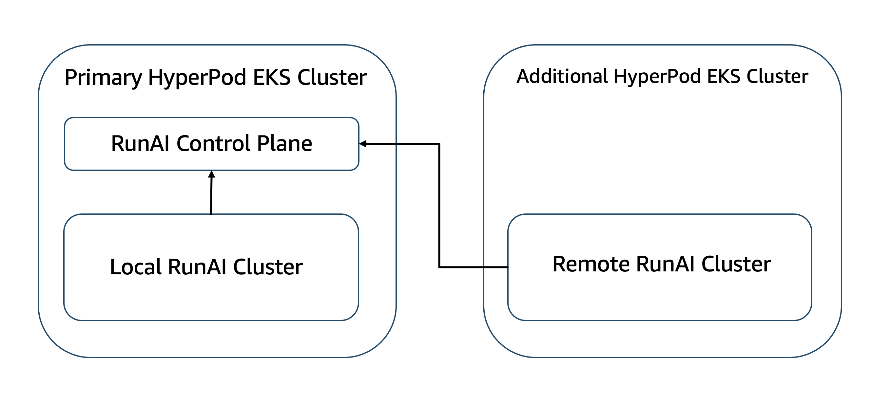</center>

Run:ai has flexible deployment architecture. It can be deployed on Amazon EKS, SageMaker HyperPod EKS, a hybrid EKS-HyperPod EKS cluster, as well as any homogenious or heterogeneous multi-cluster combination. The deployment consists of a control plane which provides a UI and management services in addition to one or more data planes (runai clusters) which provide compute services. The control plane can be self-hosted or delivered as a SaaS product.

In this example, we will deploy a self-hosted Run:ai control plane and a data plane on a hybrid EKS-HyperPod EKS cluster, then will connect an additional data plane, running on a speparate HyperPod EKS cluster. The same architecture would support adding data planes from EKS and HyperPod EKS clusters that are not necessarily co-located with the control plane. Following the same pattern, it would be possible to connect Kubernetes-based infrastructure (like EKS Anywhere) located on premises as an additional Run:ai data plane.

## 3. Infrastructure

For simplicity and reproducibility we will run commands from this document in the [aws-do-hyperpod](https://bit.ly/aws-do-hyperpod) container. This container has all of the tools and scripts referenced here, already installed. 

### 3.1. Open `aws-do-hyperpod` shell

To open a shell in the `aws-do-hyperpod` conainer by building a local copy, execute:

```sh
git clone https://github.com/aws-samples/aws-do-hyperpod
cd aws-do-hyperpod
./build.sh
./run.sh
./exec.sh
```
or to use the pre-built public container, execute:

```sh
docker run -it --rm -v $(pwd):/aws-do-hyperpod -v ${HOME}/.kube:/root/.kube -v ${HOME}/.aws:/root/.aws public.ecr.aws/hpc-cloud/aws-do-hyperpod:latest bash
```
The expected result is a shell similar to the one below.

<center>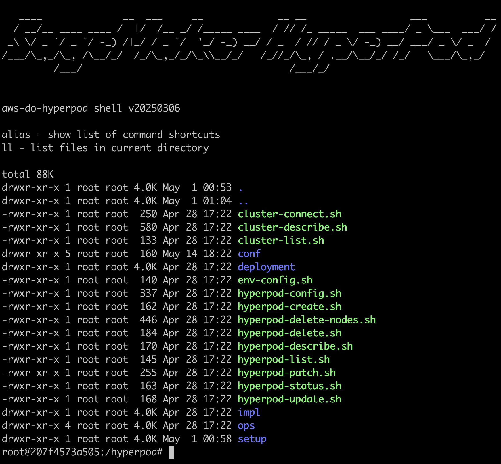</center>

### 3.2. Create EKS cluster with a CPU node group

There are many ways to create an EKS cluster, including CloudFormation, Terraform, AWS CLI, eksctl, etc. Here we will use [eksctl](https://eksctl.io) and the [eks-runai.yaml](eks/eks-runai.yaml) cluster manifest. 

#### 3.2.1. Execute eksctl

```sh
cd deployment/eks/run-ai/eks
eksctl create cluster -f ./eks-runai.yaml
```

Upon successful completion, the following log lines will be displayed:

```log
2025-05-15 02:59:27 [✔]  all EKS cluster resources for "eks-runai" have been created
2025-05-15 02:59:27 [✔]  created 1 managed nodegroup(s) in cluster "eks-runai"
2025-05-15 02:59:28 [ℹ]  kubectl command should work with "/root/.kube/config", try 'kubectl get nodes'
2025-05-15 02:59:28 [✔]  EKS cluster "eks-runai" in "us-west-2" region is ready
```

#### 3.2.2. Validate the cluster

To validate the cluster, execute the following shortcut command in the `aws-do-hyperpod` shell:

```sh
kgn
```

output:

```log
root@207f4573a505:/hyperpod/deployment/eks/run-ai/eks# kgn

kubectl get nodes -L node.kubernetes.io/instance-type -L sagemaker.amazonaws.com/node-health-status -L sagemaker.amazonaws.com/deep-health-check-status

NAME                                            STATUS   ROLES    AGE     VERSION               INSTANCE-TYPE   NODE-HEALTH-STATUS   DEEP-HEALTH-CHECK-STATUS
ip-192-168-114-223.us-west-2.compute.internal   Ready    <none>   9m10s   v1.31.7-eks-473151a   m5.16xlarge
ip-192-168-115-51.us-west-2.compute.internal    Ready    <none>   9m10s   v1.31.7-eks-473151a   m5.16xlarge
```

We use m5.16xlarge instances to allow running of sufficient number of pods when deploying the Run:ai software.

#### 3.2.3. Label runai-system nodes

To instruct Run:ai pods to get scheduled on these nodes, we need to ensure that the node role is set to `runai-system` by running the [label-set.sh](eks/label-set.sh) script or executing the following command:

```sh
kubectl label nodes $(kubectl get nodes | grep internal | cut -d ' ' -f 1 | xargs) node-role.kubernetes.io/runai-system=true --overwrite
```

It is preferred to schedule runai-system pods on the EKS CPU nodes for the following two reasons:
1. By running system pods on CPU nodes, we reserve GPU node resources for the AI/ML workloads that need GPUs.
2. The Run:ai contol and data planes require `nginx-ingress-controller` for ingress. The controller service is exposed by default as type `LoadBalancer` which utilizes a classic load balancer on AWS. This configuration is supported only when running the `nginx-ingress-controller` on EKS nodes. If it is running on HyperPod EKS nodes, then the `nginx-ingress-controller` service must be exposed via an application load balancer, which requires deployment of the AWS Load Balancer Controller, and creation of an `alb` ingress for nginx. We will demonstrate both scenarios in this document.  

#### 3.2.4. Enable EFA
When using EKS with HyperPod instance groups, it is necessary to have EFA enabled to allow the connectivity checks on the HyperPod instances to succeed before the nodes can be marked as Schedulable on the EKS cluster. 
Following the instructions in section 1.6. of the [EFA get started](https://docs.aws.amazon.com/AWSEC2/latest/UserGuide/efa-start.html#efa-start-security) documentation, add an outbound rule to the EKS security group allowing all access from the security group itself. The cluster security group can be found on the [Networking](https://us-west-2.console.aws.amazon.com/eks/clusters/eks-runai?region=us-west-2&selectedTab=cluster-networking-tab) tab in the AWS EKS console.

### 3.3. Create a HyperPod EKS cluster, attached to the existing EKS cluster

In this step, we will use the EKS cluster that we just created and attach a HyperPod EKS instance group.

#### 3.3.1. Configure the HyperPod EKS cluster to create

First, to set the cluster configuration path, execute `cd /hyperpod && ./env-config.sh` within the `aws-do-hyperpod` container and set `export CONF=conf/eks/eks-runai-hyperpod`.

Then, to configure the cluster, execute `cd /hyperpod && ./hyperpod-config.sh`. Ensure CREATE_EKS_CLUSTER is set to `false`. Set the following variables:

* CLUSTER_NAME - Name of the existing EKS cluster
* VPC_ID - VPC ID of the existing EKS cluster
* SECURITY_GROUP_ID - cluster security group id
* PRIVATE_SUBNET_ID - ID of the first private subnet in the cluster
* NAT_GATEWAY_ID - NAT gateway id for the cluster Vpc

The value for these variables can be obtained by executing the [eks-info.sh](eks/eks-info.sh) script or by looking them up starting in the [AWS EKS Console](https://us-west-2.console.aws.amazon.com/eks/clusters/eks-runai?region=us-west-2&selectedTab=cluster-networking-tab) Networking tab.

#### 3.3.2. Execute the create script

To create the HyperPod EKS cluster, from the `aws-do-hyperpod` shell, execute:

```sh
cd /hyperpod
./hyperpod-create.sh
```

The create script provisions the necessary resources, deploys dependencies, and executes an `aws sagemaker create-cluster` command to create the HyperPod cluster. Successful output looks similar to the one below:

```log
Creating HyperPod cluster ...

aws sagemaker create-cluster --cli-input-json file://hyperpod-config.json --region us-west-2

{
    "ClusterArn": "arn:aws:sagemaker:us-west-2:************:cluster/9qq4re1m1958"
}
```
#### 3.3.3. Monitor the cluster status

To monitor the hyperpod cluster status, use the folowing command:

```sh
watch ./hyperpod-status.sh
```

Wait until the ClusterStatus becomes `InService`:

```log
Status of HyperPod eks cluster eks-runai-hyperpod:

aws sagemaker list-clusters  | grep -B 2 -A 4 eks-runai-hyperpod

        {
            "ClusterArn": "arn:aws:sagemaker:us-west-2:************:cluster/9qq4re1m1958",
            "ClusterName": "eks-runai-hyperpod",
            "CreationTime": "2025-05-15T17:44:34.125000+00:00",
            "ClusterStatus": "InService",
            "TrainingPlanArns": []
        },
```

#### 3.3.4. Validate the hyperpod cluster

To validate the hyperpod cluster, execute:

```sh
kgn
```

The desired output is as follows:

```log
root@6d4a30231829:/hyperpod# kgn

kubectl get nodes -L node.kubernetes.io/instance-type -L sagemaker.amazonaws.com/node-health-status -L sagemaker.amazonaws.com/deep-health-check-status

NAME                                            STATUS   ROLES          AGE    VERSION               INSTANCE-TYPE    NODE-HEALTH-STATUS   DEEP-HEALTH-CHECK-STATUS
hyperpod-i-0115fa06cf95d8e96                    Ready    <none>         140m   v1.31.5-eks-5d632ec   ml.g5.12xlarge   Schedulable          Passed
hyperpod-i-01c9b2c73d4798ac3                    Ready    <none>         140m   v1.31.5-eks-5d632ec   ml.g5.12xlarge   Schedulable          Passed
ip-192-168-114-223.us-west-2.compute.internal   Ready    runai-system   17h    v1.31.7-eks-473151a   m5.16xlarge
ip-192-168-115-51.us-west-2.compute.internal    Ready    runai-system   17h    v1.31.7-eks-473151a   m5.16xlarge
```

The nodes that have names ending in `compute.internal` represent the EKS node group, and the nodes that have names starting with `hyperpod` represent the HyperPod instance group.
Please note the `NODE-HEALTH-STATUS` and `DEEP-HEALTH-CHECK-STATUS` columns. Hyperpod nodes will be `Unschedulable` while the deep health check is `InProgress` and will only become `Schedulable` after the deep health checks have reached status `Passed`. If all health checks are enabled it may take longer than 1 hr to complete all checks and the nodes to become schedulable.


## 4. Prerequisites

Follow the steps in this section to deploy prerequisites required by Run:ai to your cluster. Several of the prerequisites can be installed using a corresponding `install-<prerequisite-name>.sh` script located in the [prereq](prereq/) folder. Should a prerequisite need to be uninstalled, a corresponding `remove-<prerequisite-name>.sh` is also provided. There are some prerequisites that have dedicated deployment folders elsewhere within the `aws-do-hyperpod` container, as specified by the instructions below. 

### 4.1. Deploy FSX CSI driver and set default storage class

To deploy FSX container storage interface driver and set the default storage class to fsx-sc, run the following snippet within the `aws-do-hyperpod` shell:

```sh
cd /hyperpod/deployment/eks/csi/fsx
./csi-deploy.sh
cd /hyperpod/deployment/eks/csi
./sc-set.sh fsx-sc
./sc-list.sh
```

The expected output is displayed below:

```log
storageclass.storage.k8s.io/fsx-sc patched
NAME               PROVISIONER             RECLAIMPOLICY   VOLUMEBINDINGMODE      ALLOWVOLUMEEXPANSION   AGE
fsx-sc (default)   fsx.csi.aws.com         Delete          Immediate              false                  3s
gp2                kubernetes.io/aws-ebs   Delete          WaitForFirstConsumer   false                  18h
```

Note that the `fsx-sc` storage class has been created and has been set as default.

### 4.2. Deploy external-dns

You can manually create a sub-domain/hosted-zone for your cluster or deploy [external-dns](https://github.com/kubernetes-sigs/external-dns), which is a Kubernetes controller that monitors your cluster for ingress objects and creates the corresponding DNS records in Route53.

```sh
cd /hyperpod/deployment/eks/external-dns
./deploy.sh
```

Expected output:

```log
NAMESPACE: kube-system
STATUS: deployed
REVISION: 1
TEST SUITE: None
NOTES:
***********************************************************************
* External DNS                                                        *
***********************************************************************
  Chart version: 1.16.1
  App version:   0.16.1
  Image tag:     registry.k8s.io/external-dns/external-dns:v0.16.1
***********************************************************************
```

To validate the deployment, execute:

```sh
kubectl get pods -n kube-system | grep external-dns
```

Expected output:

```log
external-dns-9cfb9596f-twp98                   1/1     Running   0          6m13s
```

### 4.3. Create secrets

The required secrets include an SSL certificate and a registry secret for Run:ai images.
You can purchase an SSL certificate from an external certification authority or create a free SSL certificate using LetsEncrypt. Both the public and private key of the certificate as well as the certificate chain are needed for the Run:ai installation. In this example, we deploy cert-manager to our cluster and use it to create and export an SSL certificate from LetsEncrypt for free. If you already have a certificate, you may skip to step 4.3.3.
A registry secret is obtained through the Run:ai licensing process.

#### 4.3.1. Deploy cert-manager

To deploy cert-manger, run:

```sh
cd /hyperpod/deployment/eks/cert-manager
./cm-deploy.sh
kn cert-manager
```

Validate:

```sh
kubectl -n cert-manager get pods
```

Expected output:

```log
NAME                                      READY   STATUS    RESTARTS   AGE
cert-manager-7d94968567-74v2s             1/1     Running   0          96s
cert-manager-cainjector-d476f4bcd-rvcln   1/1     Running   0          96s
cert-manager-webhook-87964448f-98mzj      1/1     Running   0          96s
```
#### 4.3.2. Create SSL certificate

To create a LetsEncrypt SSL certificate, specify your preferred Fully Qualified Domain Name for this Run:ai instance in the following environment variable: 

```sh
export DNS_NAME=<your-preferred-fqdn>
```
##### 4.3.2.1. Create production LetsEncrypt Certificate Issuer

Please execute the following block once to set up a certificate issuer:

```sh
cd /hyperpod/deployment/eks/cert-manager/letsencrypt
kn cert-manager
./deploy-prereq.sh
./ci-create.sh
```

Validate:

```sh
./ci-list.sh
```

Output:

```log
kubectl get clusterissuer

NAME                     READY   AGE
letsencrypt-production   True    26m
```

##### 4.3.2.2. Send certifiate request
Then run the following lines:

```sh
./cert-create.sh $DNS_NAME
```

Wait for the certificate to be issued:

```sh
watch ./cert-list.sh
```

When the certificate is issued, its `READY` status will display `True`

```log
kubectl get certificate

NAME                                    READY   SECRET                                      AGE
your-certificate-name                   True    your-certificate-name-tls                   21m
```

##### 4.3.2.3. Export certificate

The certificate name will be required in this step. Execute the line below to store the certificate name in an envitonment variable. Note: If needed, you can use `./cert-list.sh` or `./cert-list.sh $DNS_NAME` to display a list of available certificate names.

```sh
export CERTIFICATE_NAME=$(echo $DNS_NAME | sed -e 's/\./-/g')
```

To export the certificate and private key as well as the certificate chain, execute:

```sh
./cert-export.sh $CERTIFICATE_NAME
```
Three files will be created in the current directory:
* ${CERTIFICATE_NAME}-chain.crt   - certificate chain
* ${CERTIFICATE_NAME}.crt         - certificate
* ${CERTIFICATE_NAME}.key         - private key

###### 4.3.2.3.1. A note about certificate renewal

Letsencrypt certificates are valid for 90 days. Cert Manager renews the certificate automatically before they expire, however the certificate does not automatically export from certmanager and apply to the runai installation. If the certificate in your runai installation is expired, you will not be able to load the runai UI. If you are using a letsencrypt certificate, repeat steps 4.3.2.3, 4.3.2.4, and 4.3.3. to renew the certificate in your runai deployment.

##### 4.3.2.4. Save certificate outside of container

By default the `aws-do-hyperpod` container has the folder where it was started from, mounted as `/aws-do-hyperpod`. To ensure that we do not lose the certificate files if the container restarts, please execute the following commans to save these certificate files outside of the container.

```sh
mkdir -p /aws-do-hyperpod/wd/cert/${CERTIFICATE_NAME}
cp -vf ${CERTIFICATE_NAME}*.* /aws-do-hyperpod/wd/cert/${CERTIFICATE_NAME}
echo ""
echo "/aws-do-hyperpod/wd/cert/${CERTIFICATE_NAME}"
ls -alh /aws-do-hyperpod/wd/cert/${CERTIFICATE_NAME}
```

#### 4.3.3. Install SSL Certificate

The SSL certificate needs to be installed in the `ingress-nginx`, and `runai` namespaces. If we are installing the Run:ai control plane, the certificate also needs to be installed in the `runai-backend` namespace.

Please set the RUNAI_BACKEND environment variable to `True` if the depoyment will include the control plane. Otherwise, optionally set it to `False`.

```sh
export RUNAI_BACKEND=True
```

To install the certificate, execute the [install-certificate.sh](prereq/install-certificate.sh) script:

```sh
kn default
cd /hyperpod/deployment/eks/run-ai/prereq
./install-certificate.sh
```

Note that some `NotFound` or `AlreadyExists` errors are acceptable from this script. 

Validate: 

```sh
kubectl get secret -n ingress-nginx
```

Expected output:

```log
NAME                                  TYPE                 DATA   AGE
nginx-ca-cert                         Opaque               1      7m2s
nginx-tls                             kubernetes.io/tls    2      7m4s
```

#### 4.3.4. Create registry secret

A secret named `runai-reg-creds` must be present in the `runai-backend` namespace when installing the Run:ai control plane, and in the `runai` namespace when installing a Run:ai cluster/data plane. With licensing the Run:ai software, you may receive a `runai-reg-creds.yaml` manifest file, which you can apply:

```sh
kubectl apply -f ./runai-reg-creds.yaml
```

or you may receive a username and password for the image registry `runai.jfrog.io`. In this case you can create the secret as follows:

```sh
export REGISTRY=runai.jfrog.io
export USERNAME=<username>
export PASSWORD=<password>
export EMAIL=<your_email>

kubectl -n runai-backend create secret docker-registry runai-reg-creds --docker-username=$USERNAME --docker-password=$PASSWORD --docker-email=$EMAIL --docker-server $REGISTRY

kubectl -n runai create secret docker-registry runai-reg-creds --docker-username=$USERNAME --docker-password=$PASSWORD --docker-email=$EMAIL --docker-server $REGISTRY
```

### 4.4. Deploy Ingress

Each Run:ai endpoint (control plane/backend or data plane/cluster) needs to be exposed behind a fully qualified domain name and secured with TLS using a trusted SSL certificate. On AWS, and in this example, we use [Route53](https://aws.amazon.com/route53/), [nginx-ingress-controller](https://github.com/kubernetes/ingress-nginx), and if required [aws-load-balancer-controller](https://kubernetes-sigs.github.io/aws-load-balancer-controller). If `nginx-ingress-controller` is deployed on EKS nodes, then it can be exposed using a [Classic Load Balancer](https://aws.amazon.com/elasticloadbalancing/classic-load-balancer/) (default behavior). If `nginx-ingress-controller` is deployed on HyperPod EKS nodes, then the `aws-load-balancer-controller` is required and nginx can only be exposed using an [Application Load Balancer](https://aws.amazon.com/elasticloadbalancing/application-load-balancer/). Choose the subsections below, based on where your `nginx-ingress-controller` pod is running, after the deployment in the next step.

#### 4.4.1. Deploy nginx-ingress-controller

Run:ai requires a deployment of nginx-ingress-controller. To install it, please run the [install-nginx.sh](prereq/install-nginx.sh) script:

```sh
cd /hyperpod/deployment/eks/run-ai/prereq
./install-nginx.sh
```

Validate:

```sh
kubectl get pods,services -n ingress-nginx -o wide
```

Expected output:

```log
NAME                                           READY   STATUS    RESTARTS   AGE   IP               NODE                                           NOMINATED NODE   READINESS GATES
pod/ingress-nginx-controller-bf596cd8b-zlxgb   1/1     Running   0          15s   192.168.104.54   ip-192-168-115-51.us-west-2.compute.internal   <none>           <none>

NAME                                         TYPE           CLUSTER-IP       EXTERNAL-IP                                                               PORT(S)                      AGE   SELECTOR
service/ingress-nginx-controller             LoadBalancer   10.100.127.189   ad84ff90f654e4dbb8ef1dab914a7f1d-1415196969.us-west-2.elb.amazonaws.com   80:30878/TCP,443:31253/TCP   15s   app.kubernetes.io/component=controller,app.kubernetes.io/instance=ingress-nginx,app.kubernetes.io/name=ingress-nginx
service/ingress-nginx-controller-admission   ClusterIP      10.100.220.171   <none>                                                                    443/TCP                      15s   app.kubernetes.io/component=controller,app.kubernetes.io/instance=ingress-nginx,app.kubernetes.io/name=ingress-nginx
```

Look at the node name where the ingress-nginx-controller pod is running above. If the node name ends with `.compute.internal`, then you have a deployment on an EKS node. If the node name begins with `hyperpod`, then the pod is running on a hyperpod node.

For EKS deployment, complete section `4.4.2.`, otherwise complete section `4.4.3.` 

#### 4.4.2. When nginx is running on EKS

##### 4.4.2.1. Create DNS record
If `nginx-ingress-controller` is deployed to an EKS node, we need to create a DNS record manually. This can be done either via the Route53 console, or by using the command line, using the `domain-*.sh` scripts, provided in the `\hyperpod\deployment\eks\external-dns` folder.

First, determine the external address of the load balancer.

```sh
kubectl get svc -n ingress-nginx
```

Example output:

```log
NAME                                 TYPE           CLUSTER-IP       EXTERNAL-IP                                                               PORT(S)                      AGE
ingress-nginx-controller             LoadBalancer   10.100.127.189   xxxxxxxxxxxxxxxxxxxxxxxxxxxxxxxx-1415196969.us-west-2.elb.amazonaws.com   80:30878/TCP,443:31253/TCP   148m
ingress-nginx-controller-admission   ClusterIP      10.100.220.171   <none>
```
Then create a `CNAME` record using the `DNS_NAME` of your SSL certificate and the external address of the load balancer:

```sh
cd /hyperpod/deployment/eks/external-dns
./record-create.sh $DNS_NAME CNAME xxxxxxxxxxxxxxxxxxxxxxxxxxxxxxxx-1415196969.us-west-2.elb.amazonaws.com
```

Validate:
```sh
./record-list.sh $(echo $DNS_NAME | cut -d '.' -f 2-)
```

The newly created record should appear in the list of records in the table returned by this command.

##### 4.4.2.2 Test nginx ingress

To test the URL, please run this command in the `aws-do-hyperpod` shell.

```sh
echo curl -i https://${DNS_NAME}
```

Then copy and paste the command in a shell outside of the container or copy and paste the URL in a browser.

You should receive response: `404 Not Found`

#### 4.4.3. When nginx is running on a HyperPod node

If there are no EKS nodes in the cluster (either none available, or cluster contains only HyprePod EKS nodes), then the nginx-ingress-controller pod will run on a HyperPod node. In this case, it is required to deploy the AWS Load Balancer Controller in order to expose the nginx service beyond the cluster boundary.

##### 4.4.3.1. Deploy AWS Load Balancer Controller

To deploy the ALB ingress controller, execute the following block within the `aws-do-hyprepod` shell:

```sh
cd /hyperpod/deployment/eks/ingress-controller/alb
kn kube-system
./deploy.sh
```

Verify:

```sh
./status.sh
```

Expected output:

```log
AWS Load Balancer Controller status ...

aws-load-balancer-controller	kube-system	1       	2025-05-19 23:58:53.866734734 +0000 UTC	deployed	aws-load-balancer-controller-1.13.2	v2.13.2

aws-load-balancer-controller-5b468b8fbf-kljqp   1/1     Running   0          58s    192.168.104.217   hyperpod-i-06df5ca2ec0ad0152   <none>           <none>
aws-load-balancer-controller-5b468b8fbf-n65n9   1/1     Running   0          58s    192.168.105.58    hyperpod-i-094f16e6f0a38538d   <none>           <none>
```

##### 4.4.3.2. Patch nginx-ingress-controller service

By default the nginx-ingress-controller has type `LoadBalancer`. We will patch it to change its type to `ClusterIP` before exposing it via an ALB ingress. Run the [./patch-nginx.sh](prereq/patch-nginx.sh) script from the `aws-do-hyprepod` container:

```sh
cd /hyperpod/deployment/eks/run-ai/prereq
./patch-nginx.sh
```

Verify:

```sh
kubectl -n ingress-nginx get svc
```

Expected result:

```log
NAME                                 TYPE        CLUSTER-IP       EXTERNAL-IP   PORT(S)          AGE
ingress-nginx-controller             ClusterIP   10.100.127.189   <none>        80/TCP,443/TCP   3d23h
ingress-nginx-controller-admission   ClusterIP   10.100.220.171   <none>        443/TCP          3d23h
```

Note the ingress-nginx-controller service is of type ClusterIP

##### 4.4.3.4. Create ALB ingress

Please ensure that environment variable DNS_NAME is set and matches your SSL certificate prior to proceeding with the control plane installation.

```sh
echo "DNS_NAME=${DNS_NAME}
```

If not set, please `export DNS_NAME=<FQDN>`

Generate the ingress manifest from the `aws-do-hyperpod` shell:

```sh
cd /hyperpod/eks/deployment/run-ai/prereq
kn ingress-nginx
cat ingress-nginx-alb.yaml-template | envsubst > ingress-nginx-alb.yaml
kubectl -n ingress-nginx apply -f ./ingress-nginx-alb.yaml
```

Verify:

```sh
kubectl -n ingress-nginx get ingress
```

Expected result:

```log
NAME                CLASS   HOSTS   ADDRESS                                                                  PORTS     AGE
ingress-nginx-alb   alb     *       k8s-ingressn-ingressn-xxxxxxxxxx-xxxxxxxxx.us-west-2.elb.amazonaws.com   80, 443   103s
```

##### 4.4.3.5. Test ALB ingress

It takes a few minutes for the ALB to be created, the DNS name to propagate, and the URL to become available. 

To test the ingress on the command line, run:

```sh
curl -i http://${DNS_NAME}
```

Expected result:

```log
<html>
<head><title>301 Moved Permanently</title></head>
<body>
<center><h1>301 Moved Permanently</h1></center>
</body>
</html>
```

```sh
curl -i https://${DNS_NAME}
```

Expected result:

```log
<html>
<head><title>404 Not Found</title></head>
<body>
<center><h1>404 Not Found</h1></center>
<hr><center>nginx</center>
</body>
</html>
```

Alternatively paste the DNS Name in a browser, you should see the nging 404 Not Found page.

### 4.5. Deploy GPU Operator

To deploy GPU Operator, run the code block below:

```sh
cd /hyperpod/deployment/eks/run-ai/prereq
./install-gpu-operator.sh
```

Validate:

```sh
kubectl get pods -n gpu-operator
```

Expected output:

```log
NAME                                                          READY   STATUS      RESTARTS   AGE
gpu-feature-discovery-cqz98                                   1/1     Running     0          3m28s
gpu-feature-discovery-dbfwq                                   1/1     Running     0          3m28s
gpu-operator-5b44fdd599-l4vx6                                 1/1     Running     0          3m36s
gpu-operator-node-feature-discovery-gc-555ccf7687-wlx67       1/1     Running     0          3m36s
gpu-operator-node-feature-discovery-master-68d694564d-56h97   1/1     Running     0          3m36s
gpu-operator-node-feature-discovery-worker-fqbvz              1/1     Running     0          3m36s
gpu-operator-node-feature-discovery-worker-km4nh              1/1     Running     0          3m37s
gpu-operator-node-feature-discovery-worker-kp88n              1/1     Running     0          3m36s
gpu-operator-node-feature-discovery-worker-q5vpd              1/1     Running     0          3m36s
nvidia-container-toolkit-daemonset-kw79v                      1/1     Running     0          3m28s
nvidia-container-toolkit-daemonset-xj6hw                      1/1     Running     0          3m28s
nvidia-cuda-validator-g5csc                                   0/1     Completed   0          2m56s
nvidia-cuda-validator-shz4t                                   0/1     Completed   0          3m17s
nvidia-dcgm-exporter-2qszt                                    1/1     Running     0          3m28s
nvidia-dcgm-exporter-gkzvl                                    1/1     Running     0          3m28s
nvidia-operator-validator-gknz5                               1/1     Running     0          3m28s
nvidia-operator-validator-t5wm6                               1/1     Running     0          3m28s
```

### 3.6. Deploy Prometheus

To deploy Prometheus, execute the [install-prometheus.sh](prereq/install-prometheus.sh) script:

```sh
cd /hyperpod/deployment/eks/run-ai/prereq
./install-prometheus.sh
```

Validate:

```sh
kubectl get pods -n monitoring
```

Expected output:

```log
NAME                                                     READY   STATUS    RESTARTS   AGE
alertmanager-prometheus-kube-prometheus-alertmanager-0   2/2     Running   0          24s
prometheus-kube-prometheus-operator-5b7c9c8f6-b78gj      1/1     Running   0          29s
prometheus-kube-state-metrics-54cf884b85-7zp66           1/1     Running   0          28s
prometheus-prometheus-kube-prometheus-prometheus-0       2/2     Running   0          24s
prometheus-prometheus-node-exporter-644cq                1/1     Running   0          29s
prometheus-prometheus-node-exporter-7h74w                1/1     Running   0          29s
prometheus-prometheus-node-exporter-d6txd                1/1     Running   0          29s
prometheus-prometheus-node-exporter-vj2gp                1/1     Running   0          29s
```

### 3.7. Depoy Knative

[Knative](https://knative.dev/docs/) is an optional component. Install it if you plan to host inference services on your Run:ai cluster. To install knative, run the [install-knative.sh](prereq/install-knative.sh) script:

```sh
cd /hyperpod/deployment/eks/run-ai/prereq
./install-knative.sh
```

Validate:

```sh
kubectl get pods -n knative-serving
kubectl get pods -n kourier-system
```

Expected output:

```log
root@6d4a30231829:/hyperpod/deployment/eks/run-ai/prereq# kubectl get pods -n knative-serving
NAME                                     READY   STATUS    RESTARTS   AGE
activator-7c48c6944d-7jtd5               1/1     Running   0          93s
autoscaler-775c659bc6-dfb9w              1/1     Running   0          93s
controller-7cf4fbd94-k2nml               1/1     Running   0          93s
net-kourier-controller-568fb445b-jrrmk   1/1     Running   0          88s
webhook-57ccdb4884-w677c                 1/1     Running   0          92s
root@6d4a30231829:/hyperpod/deployment/eks/run-ai/prereq# kubectl get pods -n kourier-system
NAME                                     READY   STATUS    RESTARTS   AGE
3scale-kourier-gateway-bd4864ccd-9jf4q   1/1     Running   0          97s
```

## 5. Deployment

The self-hosted deployment architecture of Run:ai consists of a control plane (a.k.a. runai-backend) and one or more data planes (clusters, a.k.a. runai). The control plane should be deployed first. Then one or more clusters should be deployed and connected to the control plane. A control plane and a data plane can be deployed on the same EKS cluster.

## 5.1. Run:ai Control Plane

Please ensure that environment variable DNS_NAME is set and matches your SSL certificate prior to proceeding with the control plane installation.

```sh
echo "DNS_NAME=${DNS_NAME}
```

### 5.1.1. Install helm chart

Run the following block from the `aws-do-hyperpod` shell to install the control plane helm chart:

```
kn runai-backend
cd /hyperpod/deployment/eks/run-ai/control-plane
./install-control-plane.sh
```

Expected output:

```log
Release "runai-backend" does not exist. Installing it now.
NAME: runai-backend
LAST DEPLOYED: Fri May 16 16:44:58 2025
NAMESPACE: runai-backend
STATUS: deployed
REVISION: 1
```

Optionally, to monitor the progress of the deployment, in a separate windows you can watch the pods and the jobs in the `runai-backend` namespace.

```sh
watch kubectl get pods -n runai-backend
```

and

```sh
watch kubectl get jobs -n runai-backend
```

### 5.1.2. Set FSx volume permissions

The control plane deployment creates three persistent volume claims (PVCs) in the `runai-backend` namespace. 
When the storage class for these PVCs is `fsx-sc`, we need to ensure that the volumes have proper ownership so they can be writeable by the service pods that are using them.

#### 5.1.2.1. Wait until FSx volumes become bound

We need to wait until the status of the PVCs becomes `Bound`

```sh
watch kubectl get pvc -n runai-backend
```

Expected output:

```log
NAME                                      STATUS   VOLUME                                     CAPACITY   ACCESS MODES   STORAGECLASS   VOLUMEATTRIBUTESCLASS   AGE
data-runai-backend-postgresql-0           Bound    pvc-2093ee39-3674-44df-ab88-f591af4ab86c   1200Gi     RWO            fsx-sc         <unset>                 9m5s
data-runai-backend-redis-queue-master-0   Bound    pvc-d5bfae9a-1ce4-485a-9b93-e23f3b150deb   1200Gi     RWO            fsx-sc         <unset>                 9m5s
data-runai-backend-thanos-receive-0       Bound    pvc-aba01bdf-4832-4b9a-adc3-e876109d29f5   1200Gi     RWO            fsx-sc         <unset>                 9m5s
```

#### 5.1.2.2. Set owner userid and groupid to 1001

Once the volumes are provisioned, we can mount the volumes in a pod and set the owner uid to `1001`. This is the uid used by each of the Run:ai persistent services: `postgresql`, `redis`, and `thanos`. We will do that by running the [fsx-patch.sh](control-plane/fsx-patch.sh) script in the `aws-do-hyperpod` shell.

```sh
cd /hyperpod/deployment/eks/run-ai/control-plane
kn runai-backend
./fsx-patch.sh
```

Expected output:

```log
Patching Run:ai FSX volumes ...

Starting fsx-pod ...
pod/fsx-pod created

Waiting for fsx-pod to start ...

Setting owner of fsx volumes ...

Showing fsx volumes ...

/fsx-postgres
total 58K
drwxr-xr-x  5 1001 1001 33K May 16 17:15 .
drwxr-xr-x  1 root root  72 May 16 17:33 ..

/fsx-redis
total 33K
drwxr-xr-x 4 1001 1001 33K May 16 16:53 .
drwxr-xr-x 1 root root  72 May 16 17:33 ..

/fsx-thanos
total 33K
drwxr-xr-x 4 1001 1001 33K May 16 16:53 .
drwxr-xr-x 1 root root  72 May 16 17:33 ..

Removing fsx-pod ...
pod "fsx-pod" deleted

```

Please note that the directories are now owned by user and group with id `1001`.

#### 5.1.2.3. Validate data volumes

Once the data volumes permissions are set, the `runai-backend-postgresql-0`, `runai-backend-redis-queue-master-0`, and `runai-backend-thanos-receive-0` pods will restart and enter the `Running` state. Once they do, you can see data being stored on FSx by executing the [fsx-ls.sh](control-plane/fsx-ls.sh) script in the `aws-do-hyperpod` container shell.

```sh
cd /hyperpod/deployment/eks/run-ai/control-plane
./fsx-ls.sh
```

Expected output:

```log
/fsx-postgres
total 58K
drwxr-xr-x  5 1001 1001 33K May 16 17:15 .
drwxr-xr-x  1 root root  72 May 16 17:53 ..
drwxr-xr-x. 4 1001 1001 25K May 16 17:15 data

/fsx-redis
total 45K
drwxr-xr-x 4 1001 1001 33K May 16 17:35 .
drwxr-xr-x 1 root root  72 May 16 17:53 ..
-rw-r--r-- 1 1001 1001 477 May 16 17:37 appendonly.aof

/fsx-thanos
total 58K
drwxr-xr-x  5 1001 1001 33K May 16 17:34 .
drwxr-xr-x  1 root root  72 May 16 17:53 ..
drwxr-x---. 4 1001 1001 25K May 16 17:52 default-tenant
```

#### 5.1.2.4. Validate pod status

To ensure all control plane pods are running, execute:

```sh
kubectl get pods -n runai-backend
```

Expected result:

```log
NAME                                                   READY   STATUS    RESTARTS         AGE
keycloak-0                                             1/1     Running   0                4h7m
runai-backend-assets-service-64d58dd795-jzsmd          1/1     Running   0                4h7m
runai-backend-audit-service-77f7747645-xjbwn           1/1     Running   9 (3h22m ago)    4h7m
runai-backend-authorization-5b667cc7d6-h8f8d           1/1     Running   0                4h7m
runai-backend-backend-6479cdd67-8t25p                  1/1     Running   2 (3h37m ago)    4h7m
runai-backend-cli-exposer-54dcf9f84c-m8x7h             1/1     Running   0                4h7m
runai-backend-cluster-service-55c7d46865-sxm2w         1/1     Running   9 (3h21m ago)    4h7m
runai-backend-datavolumes-dddbddd64-tvt5t              1/1     Running   0                4h7m
runai-backend-frontend-5b58d4557c-s5zz5                1/1     Running   0                4h7m
runai-backend-grafana-685f7996d8-4pnww                 2/2     Running   0                4h7m
runai-backend-identity-manager-6965d4754c-6nqcn        1/1     Running   9 (3h22m ago)    4h7m
runai-backend-k8s-objects-tracker-7688555b79-rzvnr     1/1     Running   0                4h7m
runai-backend-metrics-service-6489d64cc7-mmbvr         1/1     Running   0                4h7m
runai-backend-notifications-proxy-79cd7f7c66-brnck     1/1     Running   0                4h7m
runai-backend-notifications-service-6648567564-9qj8t   1/1     Running   0                4h7m
runai-backend-org-unit-helper-b95d54978-6h9bl          1/1     Running   2 (3h37m ago)    4h7m
runai-backend-org-unit-service-845fb6799f-8v2gv        1/1     Running   0                4h7m
runai-backend-policy-service-5899df688b-t2f99          1/1     Running   9 (3h22m ago)    4h7m
runai-backend-postgresql-0                             1/1     Running   0                4h7m
runai-backend-redis-queue-master-0                     1/1     Running   13 (3h23m ago)   4h7m
runai-backend-redoc-6fd44c67c6-qh7gc                   1/1     Running   0                4h7m
runai-backend-tenants-manager-557fdc4865-s5m5s         2/2     Running   12 (3h18m ago)   4h7m
runai-backend-thanos-query-6bd5b84576-j62lk            1/1     Running   0                4h7m
runai-backend-thanos-receive-0                         1/1     Running   13 (3h23m ago)   4h7m
runai-backend-traefik-55f76cc864-qvndv                 1/1     Running   0                4h7m
runai-backend-workloads-565676d455-jchg5               1/1     Running   9 (3h21m ago)    4h7m
runai-backend-workloads-helper-557d9ff67-fzwdl         1/1     Running   0                4h7m
```

All pods should be in the `Ready` and `Running` state.

### 5.1.3. Validate control plane deployment

To validate the control plane deployment, use one or all of the methods below.

#### 5.1.3.1. Using curl

In a regular shell (outside of the `aws-do-hyperpod` container), execute the following curl commands:

```sh
export DNS_NAME=<control_plane_fqdn>
```

```sh
curl -i http://${DNS_NAME}
```

The expected result is a redirect to https:

```log
<html>
<head><title>308 Permanent Redirect</title></head>
<body>
<center><h1>308 Permanent Redirect</h1></center>
<hr><center>nginx</center>
</body>
</html>
```

```sh
curl -i https://${DNS_NAME}
```

Expected result:

```log
HTTP/2 200
date: Fri, 16 May 2025 18:01:33 GMT
content-type: text/html
content-length: 2037
...
```

#### 5.1.3.2. Using a web browser

You can now open the control plane URL ($DNS_NAME) in a web browser.

Expected result:

<center>

</center>

Log in using the default user credentials: `test@run.ai` / `Abcd!234` and then change the default password, by clicking on the user profile in the upper-right corner, then choosing "Change password".

<center>

</center>

## 5.2. Run:ai Data Plane

The Run:ai data plane consists of Run:ai clusters that are connected to and managed by the control plane. A Run:ai cluster can be deployed either on the same EKS cluster or on a remote cluster.

After logging in to a new control plane, the UI automatically opens the "New Cluster" screen, prompting the addition of the first Run:ai cluster. Clusters can be added and removed as needed, however the UI ensures that at least one cluster exists, and does not allow removal if there is only one cluster registered.

 If the "New Cluster" screen is not opened automatically when you log in, you can navigate to it by selecting "Resources", then "Clusters" from the navigation pane on the left. Click the "+ New Cluster" button to open the screen. 

 <center>
 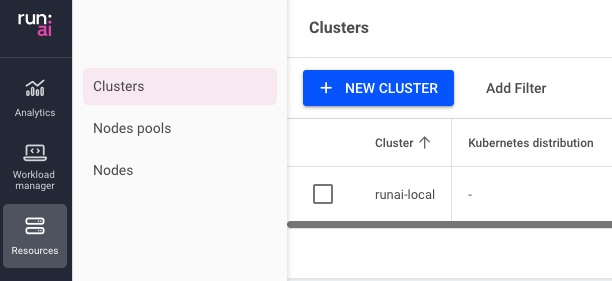
 </center>

### 5.2.1. Local Run:ai Cluster

On the "New Cluster" screen, select Cluster location: Same as control plane.

<center>
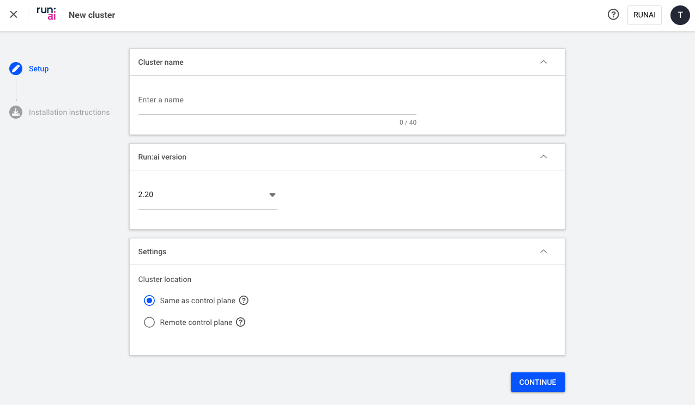
</center>

#### 5.2.1.1. Generate install script

Enter a name for your cluster. A good practice is to match the name of the EKS cluster. Then click "Continue".
A script to install the local cluster using helm is generated and displayed. 

#### 5.2.1.2. Set environment variables

In the `aws-do-hyperpod` shell, set the following environment variables copying and pasting from the displayed script:

```sh
export DNS_NAME=<value of controlPlane.url>
export CLIENT_SECRET=<value of controlPlane.clientSecret>
export CLUSTER_UID=<value of cluster.uid>
```

Verify:

```sh
echo ""
echo "DNS_NAME=${DNS_NAME}"
echo "CLIENT_SECRET=${CLIENT_SECRET}"
echo "CLUSTER_UID=${CLUSTER_UID}"
echo ""
```

#### 5.2.1.3. Run install script

To deploy the Run:ai cluster, run the [install-cluster-local.sh](data-plane/install-cluster-local.sh) script:

```sh
cd /hyperpod/deployment/eks/run-ai/data-plane
kn runai
./install-cluster-local.sh
```

#### 5.2.1.4. Monitor the installation

To monitor the installation progress, in two separate shell windows, you can run:

```sh
watch kubectl get pods -n runai
```

and

```sh
watch kubectl get jobs -n runai
```

##### 5.2.1.5. Verify pod status

Ensure all pods in the runai namespace are `Ready` and in `Running` status:

```sh
kubectl get pods -n runai
```

Expected result:

```log
NAME                                             READY   STATUS    RESTARTS        AGE
accessrule-controller-788665f547-vz2n7           1/1     Running   0               4m6s
assets-sync-6bf4d74bf8-22fhz                     1/1     Running   0               4m15s
binder-866d68b969-tpm6z                          1/1     Running   0               4m12s
cluster-api-5d74458858-nbjvq                     1/1     Running   0               4m20s
cluster-redis-7f569d86f9-wzbdv                   1/1     Running   0               4m19s
cluster-sync-6ddc568fc8-tkr2r                    1/1     Running   0               4m16s
engine-admission-9c5dcc888-t9cfw                 1/1     Running   0               4m12s
engine-operator-7d458fc9f8-d5m5p                 1/1     Running   0               4m53s
external-workload-integrator-d874745dc-6w9bw     1/1     Running   0               4m21s
inference-workload-controller-6d8f97bb85-g5f7k   1/1     Running   0               4m20s
init-ca-7fb9c5d466-2m9tn                         1/1     Running   0               4m16s
metrics-exporter-5cbcb4d4f7-hbgps                1/1     Running   0               4m20s
nodepool-controller-6b79bcb99b-pnkqf             1/1     Running   0               4m23s
pod-group-assigner-d5646777c-r2w6k               1/1     Running   0               4m6s
pod-group-controller-bdcd48b74-79xx5             1/1     Running   0               4m12s
pod-grouper-786bf4fccd-cdxk4                     1/1     Running   0               4m12s
prometheus-runai-0                               2/2     Running   0               4m20s
queue-controller-6bc57b7966-2b7qz                1/1     Running   0               4m12s
researcher-service-6db476b7fc-cm2vq              1/1     Running   0               4m23s
runai-admission-controller-6b48677989-kkrj7      1/1     Running   0               4m6s
runai-agent-6795cb849d-gqcq8                     1/1     Running   1 (4m10s ago)   4m16s
runai-container-toolkit-2tdrt                    1/1     Running   0               4m11s
runai-container-toolkit-qg244                    1/1     Running   0               4m11s
runai-job-controller-5858d7dcf-4w8lw             1/1     Running   0               4m23s
runai-node-exporter-dlrwt                        1/1     Running   0               4m12s
runai-node-exporter-p8xjn                        1/1     Running   0               4m12s
runai-operator-58bc855df9-g2qpq                  1/1     Running   0               4m53s
runai-project-controller-75494b7c59-xsqk4        1/1     Running   0               4m6s
runai-scheduler-default-677d8bf55c-zcd5g         1/1     Running   0               4m5s
shared-objects-controller-7b589cb4f9-tggnj       1/1     Running   0               4m20s
status-updater-cc644cf9-vlk2j                    1/1     Running   0               4m21s
workload-controller-846d6b5d57-ft782             1/1     Running   0               4m6s
workload-overseer-58bfcf959-rnnzc                1/1     Running   0               4m22s
```
#### 5.2.1.6. Verify cluster status 

In the Run:ai UI, navigate to the Resources->Clusters screen and check the status of the newly added cluster:

<center>
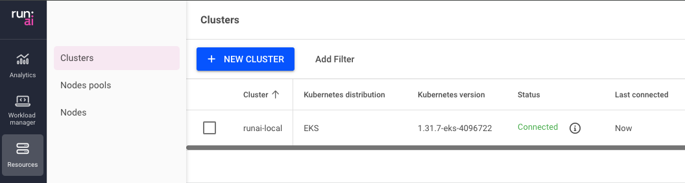
</center>

You should see the status as Connected, and when you click on the "i" icon next to the status a tooltip should show that all Run:ai services are running.

### 5.2.2. Remote Run:ai Cluster

On the "New Cluster" screen, select Cluster location: Remote control plane.

<center>
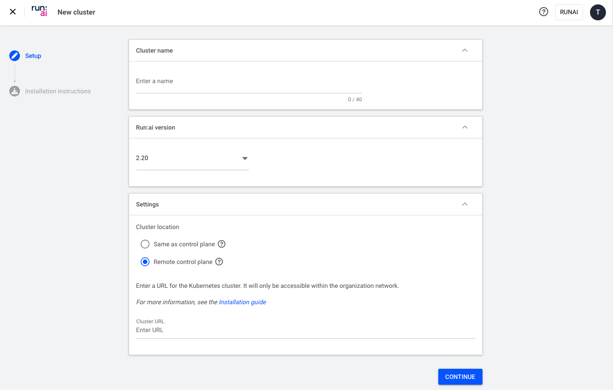
</center>

#### 5.2.2.1. Generate installation instructions

Enter the name of the remote cluster under "Cluster name". It is a good practice to match the name of the EKS cluster. Under "Cluster URL" enter `https://${DNS_NAME}`, where `DNS_NAME` is the fully qualified domain name under which the nginx ingress controller service in the remote cluster is exposed. This name should match the SSL certificate. 
Click "Continue", a screen showing the helm commands for installation of the Run:ai remote cluster will be displayed.

#### 5.2.2.2. Set environment variables

In the `aws-do-hyperpod` shell, set the following environment variables copying and pasting from the displayed script:

```sh
export DNS_NAME=<value of controlPlane.url>
export CLIENT_SECRET=<value of controlPlane.clientSecret>
export CLUSTER_UID=<value of cluster.uid>
export CLUSTER_URL=<value of cluster.url>
```

Verify:

```sh
echo ""
echo "DNS_NAME=${DNS_NAME}"
echo "CLIENT_SECRET=${CLIENT_SECRET}"
echo "CLUSTER_UID=${CLUSTER_UID}"
echo "CLUSTER_URL=${CLUSTER_URL}"
echo ""
```
#### 5.2.2.3. Run install script

To deploy the Run:ai cluster, run the [install-cluster-remote.sh](data-plane/install-cluster-remote.sh) script:

```sh
cd /hyperpod/deployment/eks/run-ai/data-plane
kn runai
./install-cluster-remote.sh
```

Expected output:

```log
```

#### 5.2.2.4. Monitor the installation

To monitor the installation progress, in two separate shell windows, you can run:

```sh
watch kubectl get pods -n runai
```

and

```sh
watch kubectl get jobs -n runai
```

##### 5.2.2.5. Verify pod status

Ensure all pods in the runai namespace are `Ready` and in `Running` status:

```sh
kubectl get pods -n runai
```

Expected result:

```log
NAME                                             READY   STATUS    RESTARTS   AGE
accessrule-controller-788665f547-scghx           1/1     Running   0          51s
assets-sync-5dc789b685-f82hd                     1/1     Running   0          60s
binder-866d68b969-5zlnw                          1/1     Running   0          58s
cluster-api-5d56fb6878-t6j88                     1/1     Running   0          67s
cluster-redis-7f569d86f9-n5r4l                   1/1     Running   0          66s
cluster-sync-f85876f76-9tl8p                     1/1     Running   0          60s
engine-admission-9c5dcc888-2cvk6                 1/1     Running   0          58s
engine-operator-7d458fc9f8-l8tnf                 1/1     Running   0          97s
external-workload-integrator-d874745dc-cjxwq     1/1     Running   0          67s
inference-workload-controller-6d4d4657c9-g6dzw   1/1     Running   0          66s
init-ca-7fb9c5d466-6n7n9                         1/1     Running   0          60s
metrics-exporter-7f745ccdfb-46gds                1/1     Running   0          66s
nodepool-controller-6b79bcb99b-88mnd             1/1     Running   0          70s
pod-group-assigner-d5646777c-ntbft               1/1     Running   0          51s
pod-group-controller-bdcd48b74-vwfhd             1/1     Running   0          58s
pod-grouper-786bf4fccd-ccm2n                     1/1     Running   0          57s
prometheus-runai-0                               2/2     Running   0          67s
queue-controller-6bc57b7966-csqwn                1/1     Running   0          58s
researcher-service-776b79899-lvf84               1/1     Running   0          69s
runai-admission-controller-6b48677989-2w8wq      1/1     Running   0          51s
runai-agent-79bc6df67b-rtf4t                     1/1     Running   0          60s
runai-container-toolkit-2jkxc                    1/1     Running   0          57s
runai-container-toolkit-mkz5t                    1/1     Running   0          57s
runai-job-controller-5858d7dcf-pgfz2             1/1     Running   0          70s
runai-node-exporter-b69rf                        1/1     Running   0          58s
runai-node-exporter-l2bl5                        1/1     Running   0          58s
runai-operator-58bc855df9-mm44x                  1/1     Running   0          97s
runai-project-controller-75494b7c59-kq46s        1/1     Running   0          51s
runai-scheduler-default-677d8bf55c-xfq4r         1/1     Running   0          58s
shared-objects-controller-7b589cb4f9-d6scc       1/1     Running   0          67s
status-updater-cc644cf9-z2smk                    1/1     Running   0          67s
workload-controller-74b6879674-cgstx             1/1     Running   0          51s
workload-overseer-58bfcf959-zp6w8                1/1     Running   0          69s
```
#### 5.2.2.6. Verify cluster status 

In the Run:ai UI, navigate to the Resources->Clusters screen and check the status of the newly added cluster:

<center>
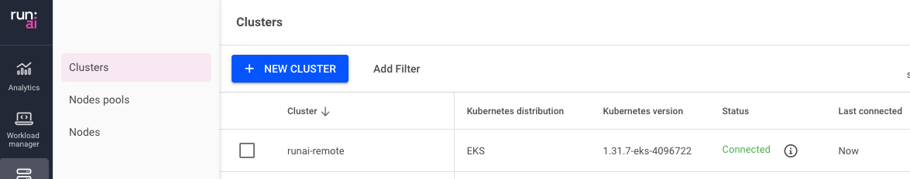
</center>

You should see the status as Connected, and when you click on the "i" icon next to the status a tooltip should show that all Run:ai services are running. Otherwise, please refer to the troubleshooting section later in this document.

## 5.3. Multi-cluster deployment

A single Run:ai control plane can be used to manage multiple EKS and HyperPod EKS clusters as shown in the example below.

<center>
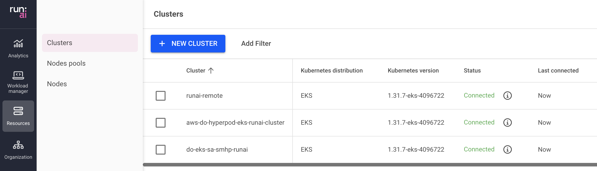
</center>

This provides a way to build multi-cluster architectures. 

The Run:ai UI allows users to select one of the clusters that they have permissions to access when performing any operations, one cluster at a time.

<center>
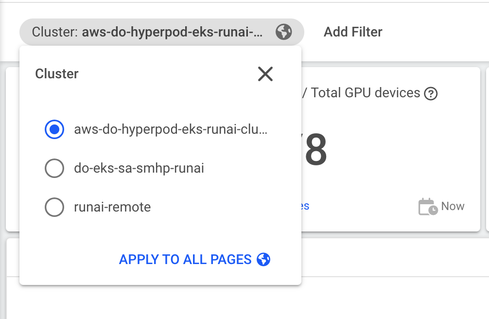
</center>

The UI also provides a top-level overview of all clusters in a single dashboard.

<center>
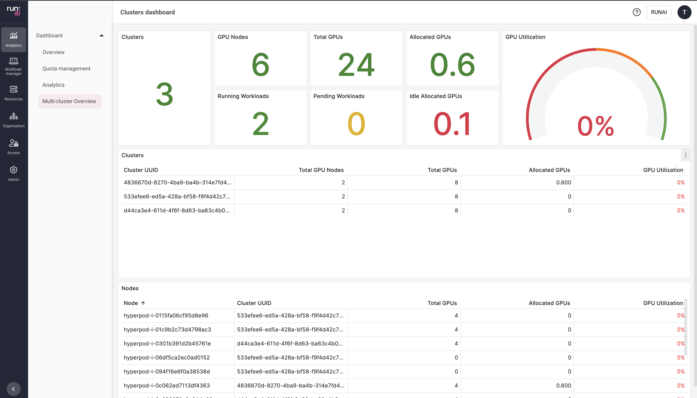
</center>

With this capability Run:ai provides a single pane of glass for clusters that reside in the same account, span accounts, AZ's, Regions, or combine Cloud and on-premises infrastructure. 

## 6. Validation

### 6.1. Organization

In this section we will create a validation project in which we will run test inference, notebook, and training workloads. For this we will use a total of 3 GPUs. If needed GPU franctions can be used to further reduce the number of GPUs needed.

Navigate to `Organization -> Projects -> + NEW PROJECT`. 
Enter `validation` as project name, then select Project total 3 GPU devices, click APPLY, then CREATE PROJECT

<center>
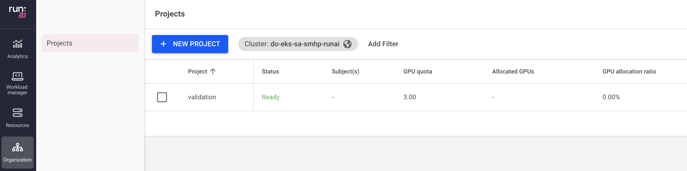
</center>


### 6.1. Test JupyterLab and GPU splitting

Navigate to `Workload manager -> Workloads -> + NEW WORKLOAD -> Workspace`. Ensure project `validation` and the `Start from scratch` template are selected. Enter `notebook` for the Workspace name, then click `CONTINUE`. Select environment `jupyter-lab` and compute resource `small-fraction`, then click `CREATE WORKSPACE`.
Wait for the notebook to enter status `Running`, then select it, and click `Connect -> Jupyter`. You will be connected to the JupyterLab instance. Please click the `Terminal` tile on the Launcher tab to open a new terminal, then type `nvidia-smi` and hit Enter.

<center>
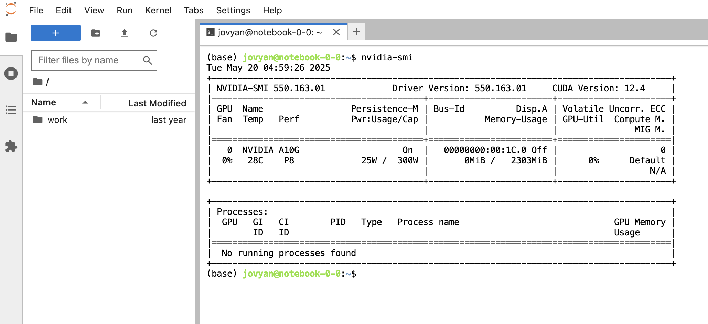
</center>

Notice the output of `nvidia-smi` showing an A10G GPU with memory of 2303MiB. This is one tenth of a single GPU.

### 6.2. Test simple inference with GPU splitting

Navigate to `Workload manager -> Environments -> + NEW ENVIRONMENT`. Set the scope to the `validation` project. Enter environment name `fast-api`, then select `Standard` and only `Inference` as the type of workload.

Paste the following Image URL: `pytorch/pytorch:2.6.0-cuda12.4-cudnn9-devel`, then type `80` for the Endpoint Container `HTTP` port.

Expand Runtime settings, and add Command: `/bin/sh`, then paste the following in the Arguments field:

```sh
-c "apt update;  apt install -y curl vim jq; pip install transformers configparser fastapi uvicorn; curl -L -o config.properties https://raw.githubusercontent.com/aws-samples/aws-do-hyperpod/refs/heads/main/Container-Root/hyperpod/deployment/eks/model-inference/fastapi/huggingface/simple-inf/Container-Root/config.properties;  sed -i -e 's/processor=cpu/processor=gpu/g' ./config.properties; . ./config.properties;  mkdir -p \$model_save_path; export HF_HOME=\$model_save_path; curl -L -o fastapi-server.py https://raw.githubusercontent.com/aws-samples/aws-do-hyperpod/refs/heads/main/Container-Root/hyperpod/deployment/eks/model-inference/fastapi/huggingface/simple-inf/Container-Root/fastapi-server.py; uvicorn fastapi-server:app --host 0.0.0.0 --port 80"
```

Finally, click `CREATE ENVIRONMENT`. We are now ready to create a new Workload. 

Navigate to `Workload manager -> Workloads -> + NEW WORKLOAD -> Inference`. Ensure project `validation` is selected, then enter `bert` as inference name and click `CONTINUE`. On the next page, select `fast-api` as the Environment, then `half-gpu` as the Compute resource. Click `CREATE INFERENCE`. Wait until the workload enters status `Running`. You may select the workload and monitor progress via the `EVENT HISTORY`, `METRICS`, and `LOGS` in the DETAILS pane.

Open the JupyterLab notebook tab from the previous section and execute the following two curl requests:

```sh
curl -i http://bert-00001-private
curl -i http://bert-00001-private/predictions/model0
```

Expected sample output:

<center>
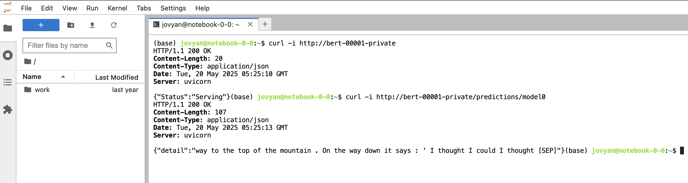
</center>

Note: Your response may be different, however you should receive output that looks like an answer to the question: "What does the little engine say?". Also note that this is a simple inference server, running on one half of a GPU.

### 6.3. Test simple distributed training

Navigate to `Workload manager -> Environments -> + NEW ENVIRONMENT`. Set project `validation` as scope. Enter `imagenet` as environment name, then select `Distributed`, set `PyTorch` as the framework, and ensure only `Training` is selected for the type of workload. 

Paste the following Image URL: `kubeflow/pytorch-elastic-example-imagenet:latest`, then expand Runtime settings, and add the following

Command: `bash`

Arguments:
```sh
-c "wget https://raw.githubusercontent.com/pytorch/elastic/master/examples/imagenet/main.py -O /workspace/examples/imagenet.py; python -m torch.distributed.run /workspace/examples/imagenet.py --arch=resnet18 --epochs=20 --batch-size=32 --workers=0 --checkpoint-file=/workspace/checkpoint.pth.tar /workspace/data/tiny-imagenet-200"
```

Click `CREATE ENVIRONMENT`. Now we are ready to create an imagenet training workload.

Navigate to `Workload manager -> Workloads -> + NEW WORKLOAD -> Training`. Ensure project `validation` is selected, select `Distributed` workload architecture with `PyTorch` framework. Select `Workers & master` for the distributed workload configuration. Use the "Start from scratch" template. Enter `imagenet` as the training name and click `CONTINUE`.

Select teh `imagenet` environment, number of workers `1`, and `one-gpu` as node resources per worker, leave the same settings selected for the master, then click `CREATE TRAINING`.

Wait for the workload to enter `Running` status. You can monitor progress by selecting the workload and opening the DETAILS pane on the right, looking at `EVENT HISTORY`, `METRICS`, and `LOGS`.

<center>
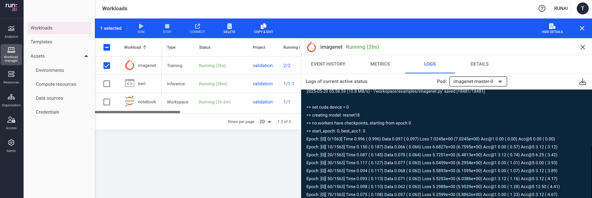
</center>

Under LOGS, you should be able to see the training steps, showing that the model training is in progress.

## 7. Cleanup

### 7.1. Remove data planes

For each of the Run:ai clusters, delete all workloads and remove all projects from the control plane first. If possible, remove the cluster from the UI console, and then execute the [remove-cluster](data-plane/remove-cluster.sh) script.

```sh
cd /hyperpod/deployment/eks/run-ai/data-plane
./remove-cluster.sh
```

Expected output:

```log
Removing Run:ai cluster ...
release "runai-cluster" uninstalled
```

### 7.2. Remove control plane

After all data planes have been cleaned up, including the last data plane, run the [remove-control-plane.sh](control-plane/remove-control-plane.sh) script.

```sh
cd /hyperpod/deployment/eks/run-ai/control-plane
./remove-control-plane.sh
```

Expected output:

```log
Removing Run.ai control plane ...
These resources were kept due to the resource policy:
[Secret] runai-backend-notifications-service

release "runai-backend" uninstalled
```

### 7.3. Remove HyperPod EKS cluster

In the `aws-do-hyperpod` shell, execute `./env-config.sh` to set the desired delete behavior by setting `export DELETE_ALL=true|false`. If set to `false`, only the hyperpod cluster will be deleted. If set to `true`, then the delete script will also try to remove the EKS cluster. This operation will only succeed if the EKS cluster was created via the `aws-do-hyperpod` container. Once you have set the desired delete behavior, run the `hyperpod-delete.sh` script.

```sh
cd /hyperpod
./hyperpod-delete.sh
```

## 8. Troubleshooting

This section provides resolutions to some generally known challenges that might arise during the lifecycle of Run:ai deployment on HyperPod EKS. The content in this section may be updated over time as new information becomes available.

<table>
<tr>
<th>ID</th><th>Challenge</th><th>Resolution</th>
</tr>
<tr>
<td>1</td><td>Run:ai cluster reports gpu stack is missing</td><td>Ensure the gpu-perator is deployed to the cluster. If the error persists, ensure AWS CloudWatch Observability Add-on is NOT deployed to the EKS cluster.</td>
</tr>
<tr>
<td>2</td><td>Unable to delete runai namespace</td><td>Remove finalizer from runaiconfig `runai`, then delete runaiconfig and namespace</td>
</tr>
<tr>
<td>3</td><td>Failure delete EKS cluster</td><td>Check CloudFormation template for root cause, there are likely other resources that need to be deleted first</td>
</tr>
</table>

## 9. References

* [NVIDIA Run:ai](https://www.nvidia.com/en-us/software/run-ai/#referrer=site&domain=run-ai)
* [NVIDIA Run:ai Documentation](https://run-ai-docs.nvidia.com/)
* [Amazon EKS](https://aws.amazon.com/eks/)
* [Amazon SageMaker HyperPod](https://docs.aws.amazon.com/sagemaker/latest/dg/sagemaker-hyperpod.html)
* [Amazon SageMaker HyperPod EKS](https://docs.aws.amazon.com/sagemaker/latest/dg/sagemaker-hyperpod-eks.html)
* [Amazon SageMeaker HyperPod EKS launch video](https://bit.ly/smhp-eks-video)
* [Amazon SageMaker HyperPod EKS Workshop](https://bit.ly/smhp-eks-workshop)
* [awsome-distributed-training](https://bit.ly/awsome-dt)
* [Docker](https://www.docker.com/)
* [do-framework](https://bit.ly/do-framework)
* [Depend on Docker project](https://github.com/iankoulski/depend-on-docker)
* [aws-do-hyperpod](https://bit.ly/aws-do-hyperpod)
* [aws-do-runai](https://bit.ly/aws-do-runai)
