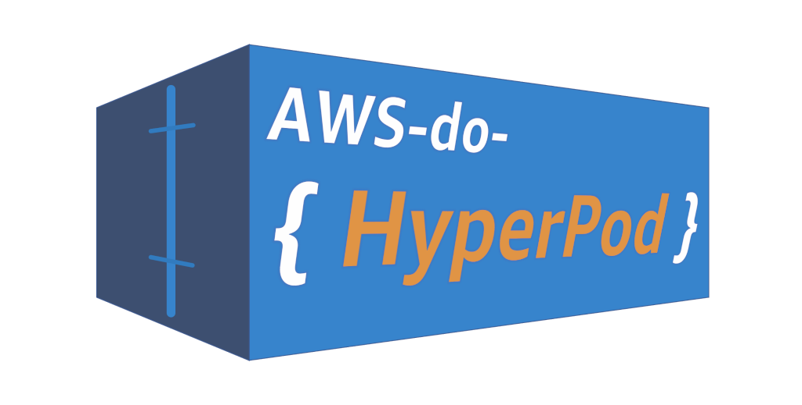
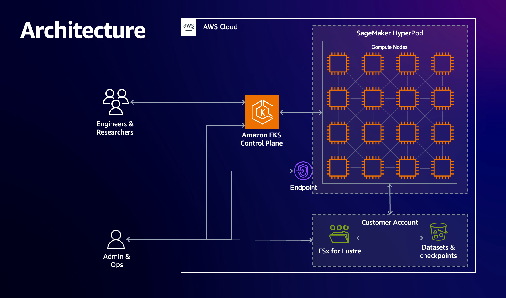
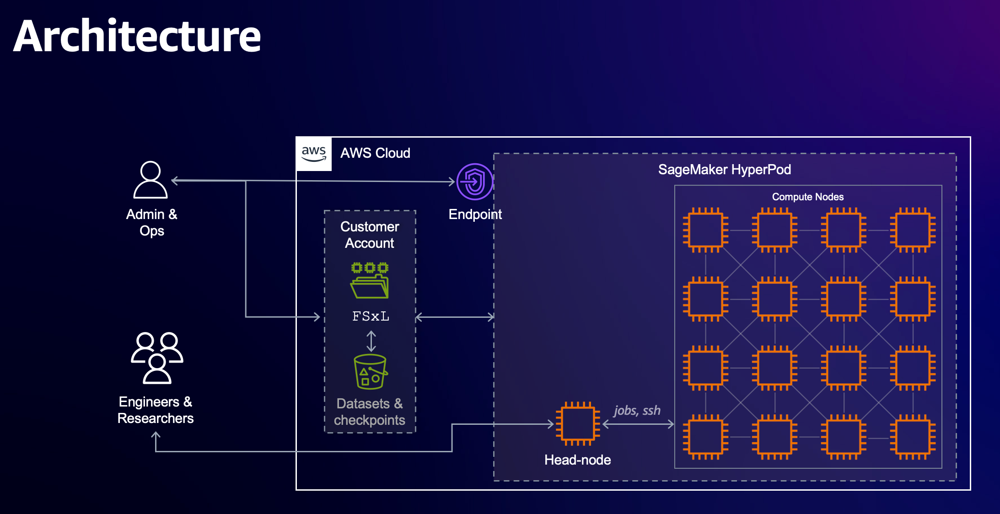

# AWS do HyperPod (aws-do-hyperpod) <br/> Create and Manage your SageMaker HyperPod clusters using the [do-framework](https://bit.ly/do-framework)

## Overview
Amazon [SageMaker HyperPod](https://aws.amazon.com/sagemaker/hyperpod/) is a managed service which provides reliable and self-healing Slurm or Kubernetes clusters, optimized for machine learning workloads.   
The [do-framework](https://bit.ly/do-framework) strives to simplify DevOps and MLOps tasks by automating complex operations into intuitive action scripts. The [aws-do-hyperpod](https://bit.ly/aws-do-hyperpod) project follows the principles of the `do-framework` to enable users to create, list, update, and delete SageMaker HyperPod clusters with simple and intuitive commands. For example, instead of running through several steps in a developer's guide to create a cluster, `aws-do-hyperpod` provides a `hyperpod-create.sh` script which wraps all necessary tools and commands to deliver a Slurm or EKS - based HyperPod cluster for a simplified and intuitive user experience. The only prerequisite needed to build and run this project is [Docker](https://docs.docker.com/get-docker/). The main use case of this project is to specify a desired cluster configuration, then create or manage the HyperPod cluster by executing the corresponding scripts. This process is described in further detail below.

## Supported Architectures
The project supports both Slurm and EKS Hyperpod implementations. This enables AWS customers to continue using their preferred workload orchestration tools, while taking advantage of the enhanced resiliency features of HyperPod.

A HyperPod cluster based on Amazon EKS is shown in the following diagram.

<center> </br>

Fig. 1 - HyperPod EKS Architecture
</center>


A Slurm-based HyperPod cluster is shown below.

<center> </br>

Fig. 2 - HyperPod Slurm Architecture
</center>

The HyperPod implementation in this project is configured through a simple setting `IMPL=eks(default)|slurm` in the environment. All standard actions: Create, Read(list/describe/status), Update, and Delete are supported for each implementation.

## Configure
Configuration items are located in three configuration files at the project, container, and cluster level. 

The [`.env`](.env) file in the project's root contains all project-level settings and is used when building and running the `aws-do-hyperpod` container. To edit this configuration, execute the [`./config.sh`](config.sh) script, or simply open the [`.env`](.env) file in your favorite editor. 

The [`conf/env.conf`](wd/conf/env.conf) file has container environment settings and is used by the scripts that create, update, or delete your HyperPod cluster. The most important settings in this file are the orchestrator implementation (`IMPL`) (eks or slurm) and the path to your cluster configuration (`CONF`). To edit this file, execute [`./env-config.sh`](env-config.sh) or open [`conf/env.conf`](wd/conf/env.conf) in your favorite editor. By default the environment is configured to use the `eks` implementation and `conf/eks/aws-do-hyperpod-eks/` contains the cluster configuration, including instance types and scale of the cluster.

The cluster-level configuration is stored in the location, specified by you in the `CONF` variable. Typically this is in a subdirectory of [conf/](wd/conf). A collection of pre-configured cluster configurations can be used immediately, or you can use the provided examples as a template to create your own cluster configuration.

AWS Credentials can be configured at the instance level through an instance role or injected into the `aws-do-hyperpod` container using volume or secrets bind-mounting. To configure credentials, run aws configure. Credentials you configure on the host will be mounted into the `aws-do-hyperpod` container according to the `VOL_MAP` setting in [`.env`](.env).

## Build
This project follows the [Depend on Docker](https://github.com/iankoulski/depend-on-docker) template to build a container including all needed tools and utilities for creation and management of your HyperPod clusters. Please execute the [`./build.sh`](./build.sh) script to create the `aws-do-hyperpod` container image. If desired, the image name or registry address can be modified in the project configuration file [`.env`](.env).

## Run
The [`./run.sh`](./run.sh) script starts the project container. After the container is started, use the [`./exec.sh`](./exec.sh) script to open a bash shell in the container. All necessary tools to allow creation, management, and operation of HyperPod are available in this shell. 

## ENV Configure
Once you have opened the `aws-do-hyperpod` shell you will be dropped in the `/hyperpod` directory where you will find the HyperPod control scripts.
Execute [`./env-config.sh`](Container-Root/hyperpod/env-config.sh) to edit the current environment settings. Here you can select the orchestrator implementation (`IMPL`) and your target cluster configuration (`CONF`).

## HyperPod Configure
The [`./hyperpod-config.sh`](Container-Root/hyperpod/hyperpod-config.sh) script opens the current cluster configuration in the default editor. You can adjust instance types and counts and other settings of the cluster through this configuration. If you wish to modify the instance groups of the cluster, you can modify the cluster configuration script [`./generate-config.sh`](./wd/conf/eks/aws-do-hyperpod-eks/generate-config.sh).

## HyperPod Create
Execute the [`./hyperpod-create.sh`](Container-Root/hyperpod/hyperpod-create.sh) script to create the configured cluster. This operation will take a while as it involves creation of a VPC, Subnets, the EKS or Slurm cluster, its nodes and any other necessary resources. Upon successful completion of this process, your shell will be configured with access to the created HyperPod cluster. 

## HyperPod Status
To view the current status of the cluster execute the [`hyperpod-status.sh`](Container-Root/hyperpod/hyperpod-status.sh) script. It will display the cluster summary as well as its current status. The status of an operational HyperPod cluster is `InService`.

## HyperPod Description
If the status of your cluster is not `InService`, you may obtain details about the cluster and check for any failure messages by running the [`./hyperpod-describe.sh`](Container-Root/hyperpod/hyperpod-describe.sh) script.

## HyperPod Update
To make changes to your existing cluster or scale out your instance node groups, afer editing the cluster configuration via [`./hyperpod-config.sh`](Container-Root/hyperpod/hyperpod-config.sh), run [`./hyperpod-update.sh`](Container-Root/hyperpod/hyperpod-update.sh).

## HyperPod Delete
To delete your cluster and remove all AWS resources associated with it, execute the [`./hyperpod-delete.sh`](Container-Root/hyperpod/hyperpod-delete.sh) script. This is a destructive operation. If there is anything in your cluster that you need saved, please persist it outside of the cluster VPC before executing this script. By default this script will only delete the HyperPod cluster. If you wish to delete the EKS or Slurm cluster as well, please set the `DELETE_ALL` variable to `true` in [`conf/env.conf`](wd/conf/env.conf).

## Shell customiazations
When you open a shell into a running `aws-do-hyperpod` container via `./exec.sh`, you will be able to execute `aws`, `kubectl` or `slurm` commands, depending on your cluster implementation. There are other tools and shell customizations that are installed in the container for convenience.

### Tools and customizations
**EKS:**
* [kubectx](https://github.com/ahmetb/kubectx) - show or set current Kubernetes context
* [kubens](https://github.com/ahmetb/kubectx) - show or set current namespace
* [kubetail](https://github.com/johanhaleby/kubetail/master/kubetail) - tail the logs of pods that have a name matching a specified pattern
* [kubectl-node-shell](https://github.com/kvaps/kubectl-node-shell) - open an interactive shell into a kubernetes node using a privileged mode (Do not use in production)
* [kubeps1](https://github.com/jonmosco/kube-ps1) - customize shell prompt with cluster info 

### Aliases
Type `alias` in your `aws-do-hyperpod` shell to see a list of active aliases:

<details>
    <summary>List of aliases</summary>

    alias dn='nodes-describe.sh'
    alias dp='pod-describe.sh'
    alias egrep='egrep --color=auto'
    alias fgrep='fgrep --color=auto'
    alias grep='grep --color=auto'
    alias k='kubectl'
    alias kc='kubectx'
    alias kctl='kubectl'
    alias kctx='kubectx'
    alias kdn='nodes-describe.sh'
    alias kdp='pod-describe.sh'
    alias ke='pod-exec.sh'
    alias kgn='nodes-list.sh'
    alias kgnt='nodes-types-list.sh'
    alias kgp='pods-list.sh'
    alias kl='pod-logs.sh'
    alias kn='kubens'
    alias kns='kubens'
    alias koff='rm -f ~/.kubeon; source ~/.bashrc'
    alias kon='touch ~/.kubeon; source ~/.bashrc'
    alias ks='kubectl node-shell'
    alias kt='kubetail'
    alias l='ls -CF'
    alias la='ls -A'
    alias ll='ls -alh --color=auto'
    alias lns='nodes-list.sh'
    alias lnt='nodes-types-list.sh'
    alias lp='pods-list.sh'
    alias ls='ls --color=auto'
    alias nl='nodes-list.sh'
    alias nsh='node-shell.sh'
    alias ntl='nodes-types-list.sh'
    alias nv='eks-node-viewer'
    alias pe='pod-exec.sh'
    alias pl='pod-logs.sh'
    alias pln='pod-logs-ns.sh'
    alias t='terraform'
    alias tf='terraform'
    alias tx='torchx'
    alias wkgn='watch-nodes.sh'
    alias wkgnt='watch-node-types.sh'
    alias wkgp='watch-pods.sh'
    alias wn='watch-nodes.sh'
    alias wnt='watch-node-types.sh'
    alias wp='watch-pods.sh'

</details>

## Other scripts

### Setup
The [`Container-Root`](Container-Root) folder hosts scripts that are used to setup, start, test the container, or generate its bill of materials.

### Infrastructure
The [`hyperpod`](Container-Root/hyperpod) folder contains [`ops`](Container-Root/hyperpod/ops), [`conf`](Container-Root/wd/conf) and [`impl`](Container-Root/hyperpod/impl) subfolders. These subfolders contain cluster-level scripts that are used by the scripts in the main folder or can be invoked independently. 

### Deployment
The [`deployment`](Container-Root/hyperpod/deployment) folder contains scripts for deploying system-level capabilities or example workloads.

### Container
The project home folder offers a number of additional scripts for management of the aws-do-eks container.
* [`./login.sh`](./login.sh) - use the currently configured aws settings to authenticate with the configured registry
* [`./push.sh`](./push.sh) - push aws-do-eks container image to configured registry
* [`./pull.sh`](./pull.sh) - pull aws-do-eks container image from a configured existing registry
* [`./status.sh`](./status.sh) - show current status of aws-do-eks container
* [`./start.sh`](./status.sh) - start the aws-do-eks container if is currently in "Exited" status
* [`./stop.sh`](./stop.sh) - stop and remove the aws-do-eks container
* [`./test.sh`](./test.sh) - run container unit tests

## Examples

### Create HyperPod EKS Cluster
This example will walk through creation of a HyperPod EKS cluster using the default configuration.

Build and run the `aws-do-hyperpod` container, then open a container shell.

```bash
git clone https://github.com/aws-samples/aws-do-hyperpod
cd aws-do-hyperpod
./build.sh
./run.sh
./exec.sh
```

Create a HyperPod cluster using the default configuration. If you wish to view the configuration use `./hyperpod-config.sh`

```bash
./hyperpod-create.sh
```

This operation can take up to 30 min. A sample log output is provided below.

<details>
    <summary>HyperPod provisioning log</summary>

    Creating HyperPod eks cluster:
    /hyperpod/impl/eks/src /hyperpod
    Deploying stack: cfn-aws-do-hyperpod-eks
    Using template: cfn/hyperpod-eks-full-stack.yaml
    Parameters: ParameterKey=ClusterName,ParameterValue=aws-do-hyperpod-eks ParameterKey=ResourceNamePrefix,ParameterValue=aws-do-hyperpod
    {
        "StackId": "arn:aws:cloudformation:us-east-1:************:stack/cfn-aws-do-hyperpod-eks/1a1b6600-54e2-11ef-844a-0affc33755d5"
    }
    Added new context arn:aws:eks:us-east-1:************:cluster/aws-do-hyperpod-eks to /root/.kube/config
    arn:aws:eks:us-east-1:************:cluster/aws-do-hyperpod-eks
    NAME         TYPE        CLUSTER-IP   EXTERNAL-IP   PORT(S)   AGE
    kubernetes   ClusterIP   172.20.0.1   <none>        443/TCP   2m55s
    namespace/hyperpod created
    serviceaccount/burnin-test created
    clusterrole.rbac.authorization.k8s.io/burnin-test created
    clusterrolebinding.rbac.authorization.k8s.io/burnin-role-binding created
    daemonset.apps/aws-efa-k8s-device-plugin-daemonset created
    Warning: resource namespaces/hyperpod is missing the kubectl.kubernetes.io/last-applied-configuration annotation which is required by kubectl apply. kubectl apply should only be used on resources created declaratively by either kubectl create --save-config or kubectl apply. The missing annotation will be patched automatically.
    namespace/hyperpod configured
    serviceaccount/health-monitoring-agent created
    clusterrolebinding.rbac.authorization.k8s.io/health-monitoring-agent-role-binding created
    clusterrole.rbac.authorization.k8s.io/system:health-monitoring-agent created
    daemonset.apps/health-monitoring-agent created
    clusterrole.rbac.authorization.k8s.io/hyperpod-node-manager-role created
    clusterrolebinding.rbac.authorization.k8s.io/hyperpod-nodes created
    clusterrole.rbac.authorization.k8s.io/neuron-device-plugin created
    serviceaccount/neuron-device-plugin created
    clusterrolebinding.rbac.authorization.k8s.io/neuron-device-plugin created
    daemonset.apps/neuron-device-plugin-daemonset created
    daemonset.apps/nvidia-device-plugin-daemonset created
    [INFO] AWS_REGION = us-east-1
    [INFO] EKS_CLUSTER_ARN = arn:aws:eks:us-east-1:************:cluster/aws-do-hyperpod-eks
    [INFO] EKS_CLUSTER_NAME = aws-do-hyperpod-eks
    [INFO] BUCKET_NAME = aws-do-hyperpod-bucket-************-us-east-1
    [INFO] EXECUTION_ROLE = arn:aws:iam::************:role/aws-do-hyperpod-ExecutionRole
    [INFO] VPC_ID = vpc-026a99b1608800ba2
    [INFO] SUBNET_ID = subnet-0de365d44170c3ba3
    [INFO] PUBLIC_SUBNET_ID = subnet-0a880698b8fde0386
    [INFO] SECURITY_GROUP = sg-0ba0ef794fb662813
    [INFO] ACCEL_COUNT = 1
    [INFO] GEN_COUNT = 1
    [WARNING] BURN_ENABLED environment variable is not set, automatically set to true.
    [INFO] BURN_ENABLED = true
    [WARNING] RECOVER_ENABLED environment variable is not set, automatically set to true.
    [INFO] RECOVER_ENABLED = true
    upload: lifecyclescripts/on_create.sh to s3://aws-do-hyperpod-bucket-************-us-east-1/on_create.sh
    /hyperpod/conf/eks/aws-do-hyperpod-eks /hyperpod/impl/eks/src /hyperpod
    {
        "ClusterName": "aws-do-hyperpod-eks",
        "Orchestrator": {
          "Eks":
          {
            "ClusterArn": "arn:aws:eks:us-east-1:************:cluster/aws-do-hyperpod-eks"
          }
        },
        "InstanceGroups": [
          {
            "InstanceGroupName": "worker-group-1",
            "InstanceType": "ml.g5.8xlarge",
            "InstanceCount": 1,
            "LifeCycleConfig": {
              "SourceS3Uri": "s3://aws-do-hyperpod-bucket-************-us-east-1",
              "OnCreate": "on_create.sh"
            },
            "ExecutionRole": "arn:aws:iam::************:role/aws-do-hyperpod-ExecutionRole",
            "ThreadsPerCore": 1,
            "EnableBurnInTest": true
          },
          {
            "InstanceGroupName": "worker-group-2",
            "InstanceType": "ml.m5.2xlarge",
            "InstanceCount": 1,
            "LifeCycleConfig": {
              "SourceS3Uri": "s3://aws-do-hyperpod-bucket-************-us-east-1",
              "OnCreate": "on_create.sh"
            },
            "ExecutionRole": "arn:aws:iam::************:role/aws-do-hyperpod-ExecutionRole",
            "ThreadsPerCore": 1
          }
        ],
        "VpcConfig": {
          "SecurityGroupIds": ["sg-0ba0ef794fb662813"],
          "Subnets":["subnet-0de365d44170c3ba3"]
        },
        "ResilienceConfig": {
          "EnableNodeAutoRecovery": true
        }
    }

    aws sagemaker create-cluster --cli-input-json file://hyperpod-config.json --region us-east-1

    {
        "ClusterArn": "arn:aws:sagemaker:us-east-1:************:cluster/ewwkrja0gw77"
    }
    /hyperpod/impl/eks/src /hyperpod

</details>

<br/>
Verify that the cluster is ready for use

```bash
./hyperpod-status.sh
```

```text
Status of HyperPod eks cluster aws-do-hyperpod-eks:

aws sagemaker list-clusters | grep -B 2 -A 3 aws-do-hyperpod-eks

        {
            "ClusterArn": "arn:aws:sagemaker:us-east-1:************:cluster/ewwkrja0gw77",
            "ClusterName": "aws-do-hyperpod-eks",
            "CreationTime": "2024-08-07T17:34:25.007000+00:00",
            "ClusterStatus": "InService"
        }
```

Verify that the cluster nodes are ready for use

```bash
kgn
```

```text
kubectl get nodes -L node.kubernetes.io/instance-type

NAME                           STATUS   ROLES    AGE   VERSION               INSTANCE-TYPE
hyperpod-i-0284ab7536dbe91aa   Ready    <none>   64m   v1.29.3-eks-ae9a62a   ml.g5.8xlarge
hyperpod-i-0b5e37dfc5f69aec1   Ready    <none>   65m   v1.29.3-eks-ae9a62a   ml.m5.2xlarge
```

Initially the cluster nodes will be in `NotReady` state. Once the burn-in procedure is completed sucessfully on a node, its status will change to `Ready`.

The default HyperPod EKS cluster has one CPU and one GPU node. You can scale these instance groups by executing `./hyperpod-config.sh` and setting the `GEN_COUNT` (number of CPU nodes) and `ACCEL_COUNT` (number of GPU nodes) variables.

You may also create other HyperPod EKS cluster configurations by making a copy of the `config/eks/aws-do-hyperpod-eks` folder and customizing the `./generate-config.sh` script. To use this configuration when creating a cluster, execute `./env-config.sh` to edit the `conf/env.conf` file and set the `CONF` variable to the path of your new configuration folder. Consequently, when you execute `./hyperpod-create.sh` your new configuration will be used instead of the default one. It is recommended that the name of the configuration folder matches the name of the cluster for consistency.

## Troubleshooting
TODO: add troubleshooting tips

## Security

See [CONTRIBUTING](CONTRIBUTING.md#security-issue-notifications) for more information.

## License

This project is licensed under the MIT-0 License. See the [LICENSE](LICENSE) file.

## Disclaimer

This sample code should not be used in production accounts, on production workloads, or on production or other critical data. You are responsible for testing, securing, and optimizing the sample code as appropriate for production-grade use based on your specific quality control practice and standards.

## References

* [Docker](https://docker.com)
* [Kubernetes](https://kubernetes.io)
* [Slurm](https://slurm.schedmd.com/)
* [Amazon Web Services (AWS)](https://aws.amazon.com/)
* [Amazon EC2 Instance Types](https://aws.amazon.com/ec2/instance-types/)
* [Amazon Elastic Kubernetes Service (EKS)](https://aws.amazon.com/eks)
* [Depend on Docker Project](https://github.com/iankoulski/depend-on-docker)
* [Amazon SageMaker HyperPod](https://aws.amazon.com/sagemaker/hyperpod/)

